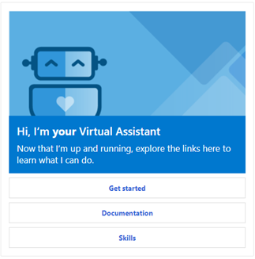
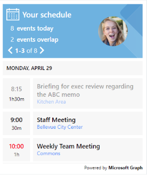

This repository is the home for a set of templates and solutions to help build conversational experiences using [Azure Bot Service](https://aka.ms/azurebotservice) and [Bot Framework](https://botframework.com).

| Name | Description |  
|:------------:|------------| 
|[ **Virtual Assistant**](/docs/) | Customers and partners have a significant need to deliver a conversational assistant tailored to their brand, personalized to their users, and made available across a broad range of canvases and devices.    Continuing Microsoft's open-sourced approach towards the Bot Framework SDK, the open-source Virtual Assistant solution provides you with a set of core foundational capabilities and full control over the end user experience.    This template incorporates the previous Enterprise Template and brings together all of the best practices and supporting components identified through building conversational experiences and greatly simplifies the creation of a new bot project including: basic conversational intents, Dispatch integration, QnA Maker, Application Insights and an automated deployment.|
|[**Skills**]((/docs/))|Developers can compose conversational experiences by stitching together re-usable conversational capabilities, known as Skills. Skills are themselves Bots, invoked remotely and a Skill developer template (.NET, TS) is available to facilitate creation of new Skills. This can be a complex Virtual Assistant or perhaps an Enterprise Bot seeking to stitch together multiple bots within an organization.  A library of re-usable conversational skill building-blocks covering conversational use-cases enabling you to add extensive functionality to a Bot within minutes. Skills include LUIS models, Dialogs and Integration code and delivered in source code form enabling you to customise and extend as required. At this time we provide Calendar, Email, ToDo, Point of Interest skills and a number of other experimental skills. |
|[**Analytics**](/docs/)| Gain key insights into your bot’s health and behavior with the Conversational AI Analytics solutions. Review available telemetry, sample Application Insights queries, and Power BI dashboards to understand the full breadth of your bot’s conversations with users. |

## Packages

### .NET
| Name | Released Package |Daily Build |
|---|---|---|
| Microsoft.Bot.Builder.Solutions                |                                  |  |
| Microsoft.Bot.Builder.Skills                |                                  |  |

## Need Help?

If you have any questions please start with [Stack Overflow](https://stackoverflow.com/questions/tagged/botframework) where we're happy to help. Please use this GitHub Repos issue tracking capability to raise [issues](https://github.com/Microsoft/AI/issues/new?assignees=&labels=Type%3A+Bug&template=bug_report.md&title=) or [feature requests](https://github.com/Microsoft/AI/issues/new?assignees=&labels=Type%3A+Suggestion&template=feature_request.md&title=).

## Reporting Security Issues
Security issues and bugs should be reported privately, via email, to the Microsoft Security Response Center (MSRC) at [secure@microsoft.com](mailto:secure@microsoft.com). You should receive a response within 24 hours. If for some reason you do not, please follow up via email to ensure we received your original message. Further information, including the [MSRC PGP](https://technet.microsoft.com/en-us/security/dn606155) key, can be found in the [Security TechCenter](https://technet.microsoft.com/en-us/security/default).

## License
Copyright (c) Microsoft Corporation. All rights reserved.
