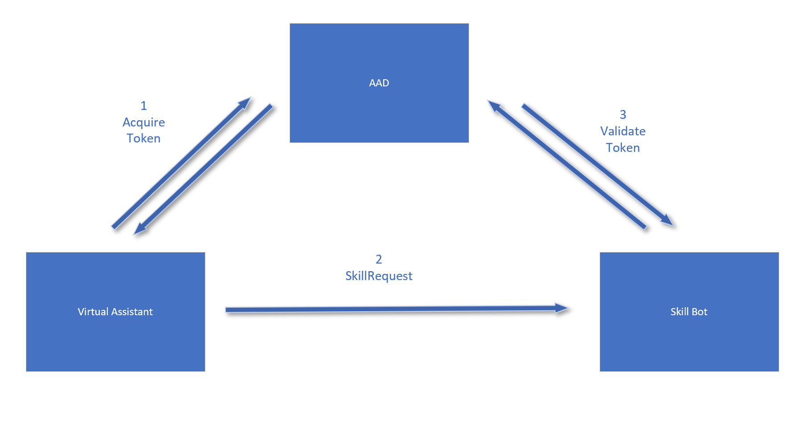

# Skill Authentication

A skill needs to be able to validate the request coming from another bot (Virtual Assistant). It needs to verify that the request comes from a properly registered bot service, and that the request was intended for the skill. To achieve this, we use AAD token mechanism



Between Virtual Assistant and skill bot, we'll use AAD as the authority to generate and validate token. The token will be a JWT token. Virtual Assistant will use these information to request a JWT token:
	1. Microsoft app id - this will become the source appid claim in the token
	2. Microsoft app password
	3. Skill bot's Microsoft app id - this will become the audience claim in the token

The JWT token will be a 'bearer' token so it'll be part of the Authorization header.

When skill bot receives a request, it looks at the Authorization header to retrieve the token. Then it will rely on AAD to decrypt & validate the JWT token. Right now the skill will only verify if the audience claim is the skill's Microsoft app id. If the audience claim verification passes, then the authentication succeeds and the request moves forward into the skill bot for further processing.

By default, a skill that's created out of a Skill Template doesn't enable authentication. Any bot can send a request to a skill bot without having to retrieve a token and the skill bot would be able to handle that request. With the support of Microsoft.Bot.Builder.Skills, it's very easy to enable authentication. You just need to add one line of code in your skill bot's startup.cs class:

```csharp
services.AddSingleton<IAuthenticationProvider, MsJWTAuthenticationProvider>();
```

With the registration of `IAuthenticationProvider` to be `MsJWTAuthenticationProvider` which is a default implementation provided by the package, the authentication is enabled on the skill bot. Any request that comes to this skill will go through the authentication so the skill is well protected.

On the Virtual Assistant side, we use the SkillDialog to dispatch requests to the skills. To enable Virtual Assistant to obtain proper JWT token to send a request to skill, you need to have these lines of code when you create the SkillDialog instances:

```csharp
var credentials = new MicrosoftAppCredentialsEx(settings.MicrosoftAppId, settings.MicrosoftAppPassword, skill.MSAappId);
skillDialogs.Add(new SkillDialog(skill, credentials, telemetryClient, userState, authDialog));
```

The `MicrosoftAppCredentialsEx` class provided within the Microsoft.Bot.Builder.Skills package is the central place to manage the information needed for the skill to obtain the AAD token. Once you pass this into the SkillDialog, the SkillDialog will be able to use it to properly retrieve the AAD token. This behavior is the default behavior if you create a Virtual Assistant out of the Virtual Assistant Template VSIX.