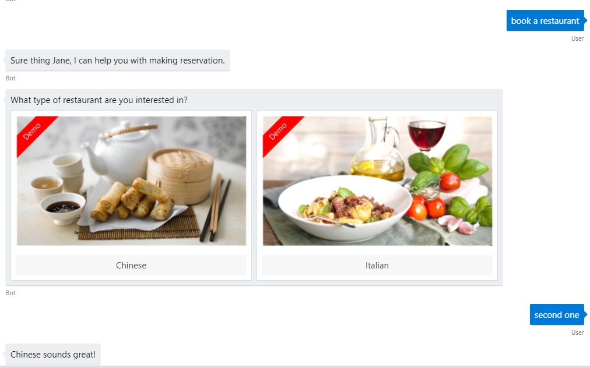

# Experimental Skills

## Overview

Experimental Skills are early prototypes of Skills to help bring skill concepts to life for demonstrations and proof-of-concepts along with providing different examples to get you started.

These skills by their very nature are not complete, will likely have rudimentary language models, limited language support and limited testing hence are located in a experimental folder to ensure this is understood before you make use of them.

## Restaurant Booking Skill

The [Restaurant Booking skill](https://github.com/Microsoft/AI/blob/master/solutions/Virtual-Assistant/src/csharp/experimental/skills/restaurantbooking) provides a simple restaurant booking experience guiding the user through booking a table and leverages Adaptive Cards throughout to demonstrate how Speech, Text and UX can be combined for a compelling user experience. No integration to restaurant booking services exists at this time so is simulated with static data for testing purposes.

An example transcript file demonstrating the Skill in action can be found [here](../../transcripts/skills-restaurantbooking.transcript), you can use the Bot Framework Emulator to open transcripts.



## News Skill

The [News skill](https://github.com/Microsoft/AI/blob/master/solutions/Virtual-Assistant/src/csharp/experimental/skills/newsskill) provides a simple Skill that integrates with the Bing News Cognitive Service to demonstrate how a news experience can be integrated into a Virtual Assistant.

An example transcript file demonstrating the Skill in action can be found [here](../../transcripts/skills-news.transcript), you can use the Bot Framework Emulator to open transcripts.


## Deploying Experimental Skills in local-mode

Experimental Skills not added by default when deploying the Virtual Assistant due to their experimental nature.

Run this PowerShell script to deploy shared resources and LUIS models required for an experimental skill.

```
  pwsh.exe -ExecutionPolicy Bypass -File DeploymentScripts\deploy_bot.ps1
```

You will be prompted to provide the following parameters:
   - Name - A name for your bot and resource group. This must be **unique**.
   - Location - The Azure region for your services (e.g. westus)
   - LUIS Authoring Key - Refer to [Virtual Assistant Deployment](../../virtual-assistant/README.md) for retrieving this key.

The msbot tool will outline the deployment plan including location and SKU. Ensure you review before proceeding.

> After deployment is complete, it's **imperative** that you make a note of the .bot file secret provided as this will be required for later steps. The secret can be found near the top of the execution output and will be in purple text.

- Update your `appsettings.json` file with the newly created .bot file name and .bot file secret.
- Run the following command and retrieve the InstrumentationKey for your Application Insights instance and update `InstrumentationKey` in your `appsettings.json` file.

```
msbot list --bot YOURBOTFILE.bot --secret YOUR_BOT_SECRET
```

```
  {
    "botFilePath": ".\\YOURBOTFILE.bot",
    "botFileSecret": "YOUR_BOT_SECRET",
    "ApplicationInsights": {
      "InstrumentationKey": "YOUR_INSTRUMENTATION_KEY"
    }
  }
```

- Finally, add the .bot file paths for each of your language configurations (English only at this time).

```
"defaultLocale": "en-us",
  "languageModels": {
    "en": {
      "botFilePath": ".\\LocaleConfigurations\\YOUR_EN_BOT_PATH.bot",
      "botFileSecret": ""
    }
    }
```
## Testing the skill in local-mode

Once you have followed the deployment instructions above, open the provided .bot file with the Bot Framework Emulator.

## Adding Experimental Skills to your Virtual Assistant deployment.

Follow the steps in `Deploying LUIS models and updating Dispatch` and `Update Virtual Assistant` within [Create a new Skill](../../skills/README.md) to configure each of the Experimental Skills as required.

Instead of the generic skill configuration examples shown in the documentation steps you should use the ones below which are tailored to each of the experimental skills.

### Recipe File updates

```
  {
      "type": "luis",
      "id": "news",
      "name": "news",
      "luPath": "..\\experimental\\skills\\newsskill\\CognitiveModels\\LUIS\\en\\news.lu"
  },
  {
      "type": "luis",
      "id": "restaurant",
      "name": "restaurant",
      "luPath": "..\\experimental\\skills\\restaurantbooking\\CognitiveModels\\LUIS\\en\\restaurant.lu"
  }
```

### Dispatch References
```
    # l_News 
    - [FindArticles](../../../../experimental/skills/newsskill/CognitiveModels/LUIS/en/news.lu#FindArticles)
    # l_Restaurant
    - [Reservation](../../../../experimental/skills/restaurantbooking/CognitiveModels/LUIS/en/restaurant.lu#Reservation)
```

### Skill Configuration in appSettings.config

 ```
    "skills":[
        {
            "type": "skill",
            "id": "NewsSkill",
            "name": "NewsSkill",
            "assembly": "NewsSkill.NewsSkill, NewsSkill, Version=1.0.0.0, Culture=neutral",
            "dispatchIntent": "l_News",
            "supportedProviders": [],
            "luisServiceIds": [
                "news",
                "general"
            ],
            "parameters": [],
            "configuration": {
                "BingNewsKey": ""
            }
        },
          {
            "type": "skill",
            "id": "RestaurantBooking",
            "name": "RestaurantBooking",
            "assembly": "RestaurantBooking.RestaurantBooking, RestaurantBooking, Version=1.0.0.0, Culture=neutral",
            "dispatchIntent": "l_Restaurant",
            "supportedProviders": [],
            "luisServiceIds": [
                "restaurant",
                "general"
            ],
            "parameters": [],
            "configuration": {}
        }
    ]
```


