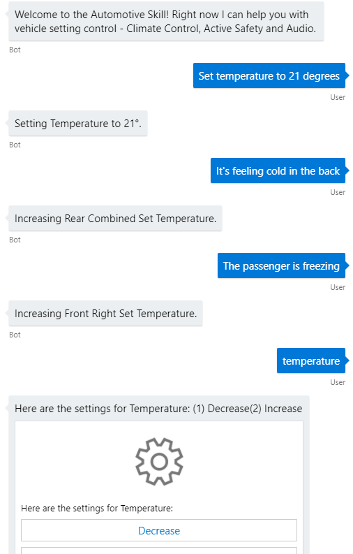

# Automotive Skill (Preview)
The Automotive Skill is in preview and demonstrates the first capabilities to help enable Automotive scenarios. The skill focuses on Vehicle Settings, specifically Climate Control, Safety and Basic audio controls. Media, Tuner and Phone capabilities are expected in a future release.

Vehicle Control is a complicated domain, whilst there are only a limited set of car controls for climate control there are a myriad of ways that a human can describe a given setting. For example, `I'm feeling chilly` , `My feet are cold` and `It's cold here in the back` all relate to a decrease in temperature but to different parts of the car and perhaps even different fan settings.

The Skill leverages a set of LUIS models to help understand the intent and entities but then leverages capabilities from our Maluuba team to match potential settings and actions to the available settings to then suggest a course of action.

Unlike the Productivity and PoI skills that are integrated into existing services, the automotive skill will require integration with the telematics solution in use by a given OEM so will require customisation to reflect actual car features for a given OEM along with integration.

To enable testing and simulation any action identified is surfaced to the calling application as an event, this can easily be seen within the Bot Framework Emulator and will be wired up into the Web Test harness available as part of the Virtual Assistant solution.

## Table of Contents
- [Supported Scenarios](#supported-scenarios)
- [Language Model](#language-model)
- [Event Responses](#event-responses)
- [Configuration](#configuration)

## Supported Scenarios

At this time, changes to vehicle settings are supported through the `VEHICLE_SETTINGS_CHANGE` and `VEHICLE_SETTINGS_DECLARATIVE` intents. The former enables questions such as "change the temperature to 21 degrees" whereas the latter intent enables scenarios such as "I'm feeling cold" which require additional processing steps.

The following vehicle setting areas are supported at this time, example utterances are provided for guidance. In cases where the utterance results in multiple potential settings or a value isn't provided then the skill will prompt for disambiguation. Confirmation will be sought from the user if a setting is configured to require confirmation, important for sensitive settings such as safety.

### Climate Control

- *Set temperature to 21 degrees*
- *Defog my windshield*
- *Put the air on my feet*
- *Turn off the ac*
- *I'm feeling cold*
- *It's feeling cold in the back*
- *The passenger is freezing*
- *Change climate control*

### Safety

- *Turn lane assist off*
- *Enable lane change alert*
- *Set park assist to alert*

### Audio

- *Adjust the equalizer*
- *Increase the bass*
- *Increase the volume*

Vehicle settings can be selected through explicit entry of the vehicle setting name, numeric or ordinal (first one, last one).

An example transcript file demonstrating the Skill in action can be found [here](../../transcripts/skills-automotive.transcript), you can use the Bot Framework Emulator to open transcripts.



## Language Model
LUIS models for the Skill are provided in .LU file format as part of the Skill. These are currently available in English with other languages to follow.

The following Top Level intents are available with the main `settings` LUIS model

- VEHICLE_SETTINGS_CHANGE
- VEHICLE_SETTINGS_DECLARATIVE

In addition there are two supporting LUIS models `settings_name` and `settings_value`, these are used for disambiguation scenarios to clarify setting names and values where the initial utterance doesn't provide clear information.

## Event Responses

The Automotive Skill surfaces setting changes for testing purposes through an event returned to the client. This enables easy testing and simulation, all events are prefixed with `AutomotiveSkill.`. The below event is generated as a response to `I'm feeling cold`
```
{
  "name": "AutomotiveSkill.Temperature",
  "type": "event",
  "value": [
    {
      "Key": "valueingform",
      "Value": "Increasing"
    },
    {
      "Key": "settingname",
      "Value": "Temperature"
    }
  ]
}
```

## Configuration

### Authentication Connection Settings

> No Authentication is required for this skill

### Skill Parameters

> No Parameters are required for this skill

### Example Skill Registration Entry
```
{
    "type": "skill",
    "id": "automotiveSkill",
    "name": "automotiveSkill",
    "assembly": "AutomotiveSkill.AutomotiveSkill, AutomotiveSkill, Version=1.0.0.0, Culture=neutral",
    "dispatchIntent": "l_Automotive",
    "supportedProviders": [],
    "luisServiceIds": [
      "settings",
      "settings_name",
      "settings_value",
      "general"
    ],
    "parameters": []
    ],
    "configuration": {
       "ImageAssetLocation": "http://tempuri.org"
     }
}
```

### Customising Vehicle Settings

Available vehicle settings are defined in a supporting metadata file which you can find in this location:  `automotiveskill\Dialogs\VehicleSettings\Resources\available_settings.yaml`.

To add an new setting along with appropriate setting values it's easily expressed in YAML. The example below shows a new Volume control setting with the ability to Set, Increase, Decrease and Mute the volume.

```
canonicalName: Volume
values:
  - canonicalName: Set
    requiresAmount: true
  - canonicalName: Decrease
    changesSignOfAmount: true
  - canonicalName: Increase
    antonym: Decrease
  - canonicalName: Mute
allowsAmount: true
amounts:
  - unit: ''
```

 For key settings you may wish to prompt for confirmation, safety settings for example. This can be specified through a `requiresConfirmation` property as shown below.

```
canonicalName: Lane Change Alert
values:
  - canonicalName: Off
    requiresConfirmation: true
  - canonicalName: On
```

### Deploying the Skill in local-mode

The Automotive skill is not added by default when deploying the Virtual Assistant as this is a domain specific skill.

Run this PowerShell script to deploy your shared resources and LUIS models.

```
  pwsh.exe -ExecutionPolicy Bypass -File DeploymentScripts\deploy_bot.ps1
```

You will be prompted to provide the following parameters:
   - Name - A name for your bot and resource group. This must be **unique**.
   - Location - The Azure region for your services (e.g. westus)
   - LUIS Authoring Key - Refer to [this documentation page](../../virtual-assistant/csharp/gettingstarted.md) for retrieving this key.

The msbot tool will outline the deployment plan including location and SKU. Ensure you review before proceeding.

> After deployment is complete, it's **imperative** that you make a note of the .bot file secret provided as this will be required for later steps. The secret can be found near the top of the execution output and will be in purple text.

- Update your `appsettings.json` file with the newly created .bot file name and .bot file secret.
- Run the following command and retrieve the InstrumentationKey for your Application Insights instance and update `InstrumentationKey` in your `appsettings.json` file.

```
msbot list --bot YOURBOTFILE.bot --secret YOUR_BOT_SECRET
```

```
  {
    "botFilePath": ".\\YOURBOTFILE.bot",
    "botFileSecret": "YOUR_BOT_SECRET",
    "ApplicationInsights": {
      "InstrumentationKey": "YOUR_INSTRUMENTATION_KEY"
    }
  }
```

- Finally, add the .bot file paths for each of your language configurations (English only at this time).

```
"defaultLocale": "en-us",
  "languageModels": {
    "en": {
      "botFilePath": ".\\LocaleConfigurations\\YOUR_EN_BOT_PATH.bot",
      "botFileSecret": ""
    }
    }
```

Once you have followed the deployment instructions above, open the provided .bot file with the Bot Framework Emulator.

### Adding the Skill to an existing Virtual Assistant deployment

Follow the instructions below to add the Automotive Skill to an existing Virtual Assistant deployment that you have.

1. Update the Virtual Assistant deployment scripts.
    - Add the additional automotive skill LUIS models to the bot.recipe file located within your assistant project: `assistant\DeploymentScripts\en\bot.recipe`
        ```
        {
            "type": "luis",
            "id": "settings",
            "name": "settings",
            "luPath": "..\skills\automotiveskill\automotiveskill\CognitiveModels\LUIS\en\settings.lu"
        },
        {
            "type": "luis",
            "id": "settings_name",
            "name": "settings_name",
            "luPath": "..\skills\automotiveskill\automotiveskill\CognitiveModels\LUIS\en\settings_name.lu"
        },
        {
            "type": "luis",
            "id": "settings_value",
            "name": "settings_value",
            "luPath": "..\skills\automotiveskill\automotiveskill\CognitiveModels\LUIS\en\settings_value.lu"
        },

        ```
    - Add dispatch references to the core LUIS intents for the skill within the **assistant\CognitiveModels\en\dispatch.lu** file as shown below. Only the vehicle settings model is required for dispatch. This enables the Dispatcher to understand your new capabilities and route utterances to your skill
        ```
        # l_Automotive
        - [VEHICLE_SETTINGS_CHANGE](../../../../skills/automotiveskill/automotiveskill/CognitiveModels/LUIS/en/settings_dispatch.lu#VEHICLE_SETTINGS_CHANGE)
        ```
2. Run the following script to deploy the new Automotive Skill LUIS models and to update the dispatcher.
    ```
    pwsh.exe -ExecutionPolicy Bypass -File DeploymentScripts\update_published_models.ps1 -locales "en-us"
    ```
3. In Virtual Assistant, add the skill configuration entry (in an earlier section) to **appsettings.json**. This tells the Virtual Assistant that there is a new skill available for use.

4. Run the LuisGen tool to update the strongly-typed Dispatch class (Dispatch.cs) to reflect the additional dispatch target.
    ```
    LUISGen DeploymentScripts\en\dispatch.luis -cs Dispatch -o Dialogs\Shared\Resources
    ```
5. Update **MainDialog.cs** within your Assistant project with the dispatch intent for your skill (l_automotive). This can be found in the assistant/dialogs/main folder of your project.
    

6. Add a project reference from your Virtual Assistant project to the Automotive Skill, this will ensure the DLL housing the skill can be found at runtime for skill activation.

7. In order for Adaptive Cards to render images associated with the Automotive skill you will need to take the Image assets located in the `wwwroot\images` folder of the Automotive skill and place in a HTTP location (potentially your Bot deployment) and place the base URI path in the skill configuration `ImageAssetLocation` property. If you skip this step, Adaptive Cards will not render with images correctly.
