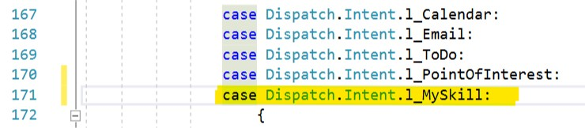

# Create a New Skill using the Skill Template
1. Install VSIX from [MyGet](https://botbuilder.myget.org/gallery/aitemplates).
2. Add a new **Skill Template with Tests** project to your solution in the Skills folder. 
    

    

     > NOTE: Your skill must be in the Virtual-Assistant\src\csharp\skills directory to ensure proper resource loading.

    

3. Rebuild project to verify there are no errors.
4. Add your Skill LUIS models to the bot.recipe file located within your assistant project: `assistant\DeploymentScripts\en\bot.recipe
    ```
        {
            "type": "luis",
            "id": "MySkill",
            "name": "MySkill",
            "luPath": "..\\skills\\MySkill\\MySkill\\CognitiveModels\\LUIS\\en\\MySkill.lu"
        }
    ```
5. Add dispatch references to the core LUIS intents for the skill within the `assistant\CognitiveModels\LOCALE\dispatch.lu` file as shown below and repeat for all locales your skill supports. This enables the Dispatcher to understand your new capabilities and route utterances to your skill.
     
    ```
        # l_MySkill 
        - [Sample intent](../../../../skills/MySkill/MySkill/CognitiveModels/LUIS/en/MySkill.lu#Sample)
    ```

6. If you have **already deployed your Virtual Assistant** prior to adding your skill, run **update_published_models.ps1** to deploy the new Skill LUIS models and to update the dispatcher (NOTE: if you omit the locales parameter it will update all languages).
    ```
    pwsh.exe -ExecutionPolicy Bypass -File DeploymentScripts\update_published_models.ps1 -locales "en-us"
    ```
    Otherwise if you **have not deployed your Virtual Assistant**, run **deploy_bot.ps1** to deploy all your bot services, LUIS, QnA Maker, and Dispatch models.
    ```
    pwsh.exe -ExecutionPolicy Bypass -File DeploymentScripts\Deploy_Bot.ps1
    ```

7. In Virtual Assistant, add a project reference to your new skill project. This tells the Virtual Assistant that there is a new skill available for use. (Right-click your project, go to **Add > Reference** and select your skill project from the list.)

8. In Virtual Assistant, add your skill configuration to **appsettings.json** 

    ```
       "skills":[
            {
                "type": "skill",
                "id": "MySkill",
                "name": "MySkill",
                "assembly": "MySkill.MySkill, MySkill, Version=1.0.0.0, Culture=neutral",
                "dispatchIntent": "l_MySkill",
                "supportedProviders": [],
                "luisServiceIds": [
                    "MySkill",
                    "general"
                ],
                "parameters": [],
                "configuration": {}
            }
        ]
    ```
9. Run the LuisGen tool to update Dispatch.cs.
    ```
    LUISGen assistant\DeploymentScripts\en\dispatch.luis -cs Dispatch -o assistant\Dialogs\Shared\Resources 
    ```
10. Update **assistant\Dialogs\Main\MainDialog.cs** with the dispatch intent for your skill.
    

11. Run the Virtual Assistant project.
12. Test your new skill with the query "sample dialog".

    

# Customizing your Skill
1. Start by identifying the different tasks your skill will handle.
    - Consider both the local and skill mode experience in your design. A skill should work well in isolation and when included in an assistant solution.

2. Design your LUIS model and update the **.lu** file for your Skill (Found in CognitiveModels\LUIS folder) with your intents, utterances, and entities. 
    - Keep your intents discrete and avoid overlap with other skills you'll be adding to your assistant.
    - More information on authoring .lu files can be found [here](https://github.com/Microsoft/botbuilder-tools/blob/master/packages/Ludown/docs/lu-file-format.md).
    - Run **update_published_model.ps1** to update your Skill LUIS model with your new intents. 
    - Run the LuisGen tool to update MySkillLU.cs (found in "./Dialog/Shared/Resources") This gives you a strongly typed representation of your LUIS model.
        ```
        LUISGen YOUR_SKILL_PROJECT_DIRECTORY\DeploymentScripts\en\MySkill.luis -cs YourSkillLU -o YOUR_SKILL_PROJECT_DIRECTORY\Dialogs\Shared\Resources 
        ```
3. Create your dialogs
    - Create a folder for your dialog with a relevant name in the Dialogs folder of your skill. 
    - Right-click the folder and go to **Add > New Iem** and select **Skill Dialog** in the Bot Framework folder.
    - Name your dialog and click **Add**.
    - Add the following using statements in your new dialog class:

        ```
            using YOUR_PROJECT_NAME.Dialogs.Shared;
            using YOUR_PROJECT_NAME.ServiceClients;
        ```
    - Set the build action on your Responses.json files to **EmbeddedResource**.

        
    
    - Register your responses in Startup.cs and Bot.cs (named **YOUR_SKILL.cs**) (this ensures your skill responses will work in both local and skill mode)

        **Startup.cs**
        ```
        var responseManager = new ResponseManager(
            new IResponseIdCollection[]
            {
                new MainResponses(),
                new SharedResponses(),
                new SampleResponses(),
                new MyDialogResponses()
            }, connectedServices.LocaleConfigurations.Keys.ToArray());
        ```
        
        **Bot.cs**
        ```
        var responseManager = new ResponseManager(
            new IResponseIdCollection[]
            {
                new MainResponses(),
                new SharedResponses(),
                new SampleResponses(),
                new MyDialogResponses()
            }, connectedServices.LocaleConfigurations.Keys.ToArray());
        ```

    - Register your new dialog in MainDialog.cs in the RegisterDialogs() method

        ```
            private void RegisterDialogs()
            {
                AddDialog(new MyDialog(_services, _responseManager, _conversationStateAccessor, _userStateAccessor, _serviceManager, TelemetryClient));
            }
        ```

    - Wire up your dialog to a LUIS intent in MainDialog.RouteAsync() method

        ```
        switch (intent)
                    {
                        case MySkillLU.Intent.MyIntent:
                            {
                                await dc.BeginDialogAsync(nameof(MyDialog), skillOptions);
                                break;
                            }

                    ...
        ```


4. Update the skill configuration in Virtual Assistant appsettings.json
    - **supportedProviders**: this section is for identifying the different authentication providers your skill supports. If your skill does not provide an authenticated experience, leave this section blank. The value is the "Service Provider" from your OAuth connection in the Azure portal.

        ```
            "supportedProviders": [
                "Azure Active Directory v2",
                "Google"
            ]
        ```

        

    - **luisServiceIds**: this section identifies which LUIS service configurations should be sent from the Virtual Assistant to your skill. Include ids for any LUIS models your skill will need to access in this list. The id for a LUIS service is found in the .bot file configuration.
        ```
            "luisServiceIds": [
                "calendar",
                "general"
            ]
        ```
    - **parameters**: this section is for state values the Virtual Assistant should pass to your skill. For example, the Assistant might have access to the user's location, timezone, and other preferences that the skill might want to access.
        ```
            "parameters": [
                "IPA.Timezone"
            ]
        ```
    - **configuration**: this section is for any additional key/value configuration the skill may need. For example, if there is a service subscription key the skill needs, this should be supplied through the Virtual Assistant and will be passed to the skill at initialization.
        ```
            "configuration": {
                "AzureMapsKey": ""
            }
        ```
