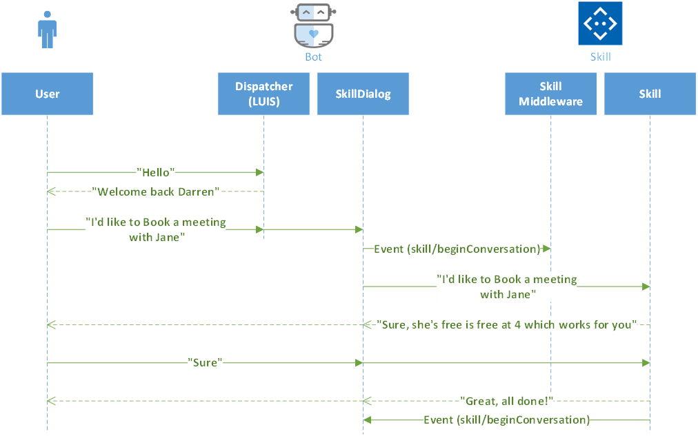

# Skills Overview

Skills are a type of bot that allows developers to develop and test them like a standard bot, while having the functionality to plug in to a greater Virtual Assistant solution.
Apart from minor difference to enable this special invocation pattern, a Skill looks and behaves like a regular bot. The same protocol is maintained between two bots to ensure a consistent approach.
Skills for common scenarios like productivity and navigation to be used as-is or customized however a customer prefers.
> The Skill functionality for Virtual Assistants will inform the broader Azure Bot Service skill approach moving forward.

## Table of Contents
- [Skills Overview](#skills-overview)
  - [Table of Contents](#table-of-contents)
  - [Create a New Skill](#create-a-new-skill)
  - [Skill Invocation Flow](#skill-invocation-flow)
  - [Registration](#registration)
  - [Dispatching Skills](#dispatching-skills)
  - [Using the SkillDialog](#using-the-skilldialog)
  - [Interrupting Active Skills](#interrupting-active-skills)

## Create a New Skill

Use the Skill Template to [Create a New Skill](./create.md) with an out-of-the-box basic Skill and unit test project.

## Skill Invocation Flow

All communication between a Virtual Assistant and a Skill is performed through a custom `SkillDialog`, started when the dispatcher identifies a Skill that maps to a user's utterances. Skills are invoked through a lightweight `InProcAdapter`, maintaining the communication protocol and ensuring Skills can be developed using the standard Bot Framework toolkit.

`SkillDialog` bootstraps the `InProcAdapter` and processes appropriate middleware before invoking the `OnTurn` method on the Bot for each Activity. A `skillBegin` event is sent at the beginning of each Skill Dialog and the end of a Skill Dialog is marked by the sending of a `endOfConversation` event.



## Registration

Each Skill is registered with a Virtual Assistant through the configuration entry shown below

|Name|Description|
---|---
Name | The name of your Skill|
DispatchIntent| The name of the intent within the Dispatch model which covers your Skills LUIS capabilities|
SupportedProviders| The Supported Authentication Providers provides the ability to highlight which authentication providers this skill supports (if any). This enables the Virtual Assistant to retrieve the token related to that provider when a user asks a question.|
LuisServiceIds| The LUIS model names used by this skill. All Skills will make use of the General model along with their own LUIS model.|
Parameters| Parameters are an optional mechanism to pass user-data across a part of the Skill invocation. For example, a Skill may request access to the users current location or timezone to better personalise the experience. This Parameters are sourced automatically from the Virtual Assistant state for a given User/Conversation and provided to the Skill.|
Configuration| Skills are invoked in-process to the Virtual Assistant so don't have access to their respective appsettings.json file, in cases where a Skill needs configuration data it can be provided through this mechanism. LUIS Configuration settings and secrets for a web-service used by a Skill are examples of configuration.|

 ```
  "skills": [
    {
      "type": "skill",
      "id": "calendarSkill",
      "name": "calendarSkill",
      "dispatchIntent": "l_Calendar",
      "supportedProviders": [
        "Azure Active Directory v2",
        "Google"
      ],
      "luisServiceIds": [
        "calendar",
        "general"
      ],
      "parameters": [
        "IPA.Timezone"
      ],
      "configuration": {
        "configSetting1": "",
        "configSetting2": "",
      }
    },
 ```
 
## Dispatching Skills
When a user tries to trigger a Skill, the Virtual Assistant needs to know how to process that and correctly map to a registered Skill.
The [Dispatch](https://docs.microsoft.com/en-us/azure/bot-service/bot-builder-tutorial-dispatch?view=azure-bot-service-4.0) model identifies all registered Skill LUIS models and how it should be processed locally (through LUIS and code, QnA Maker, or by invoking a Skill with `SKillDialog`).

## Using the SkillDialog
Each Skill uses a `SkillDialog` class to manage it's invocation.
The Virtual Assistant identifies a Skill to use and creates a new `SkillDialog` instance with configuration properties as a parameter. 
Through reflection, the dialog instantiates the Skill and invokes the `OnTurn` handler to begin the Skill. 
Skills require a new state container, configured in your Virtual Assistant's configured state store, to ensure state is maintained at the highest level. 
This dialog is active on the Virtual Assistant's `DialogStack`, ensuring that subsequent utterances are routed to your Skill. 
When an `EndOfConversation` event is sent from the Skill, it tears down the `SkillDialog` and returns control back to the user.

## Interrupting Active Skills
Skills can be interrupted through a top-level interruption (e.g. "cancel"). The user is prompted to confirm before tearing down the active Skill.