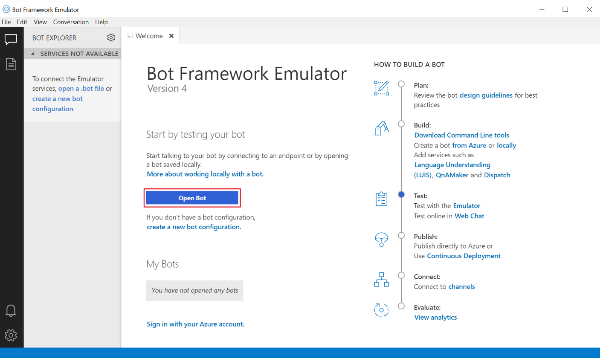
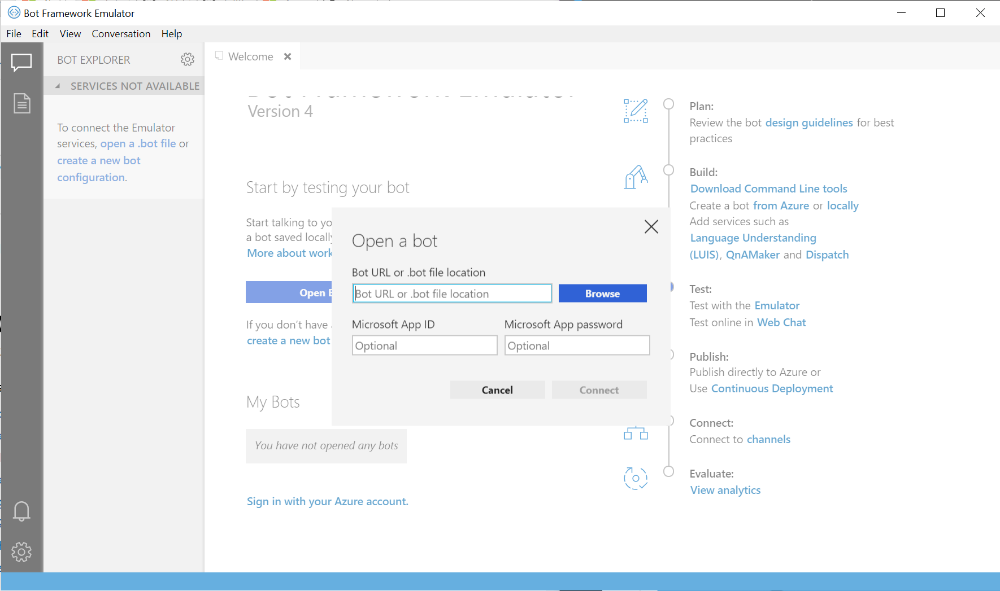
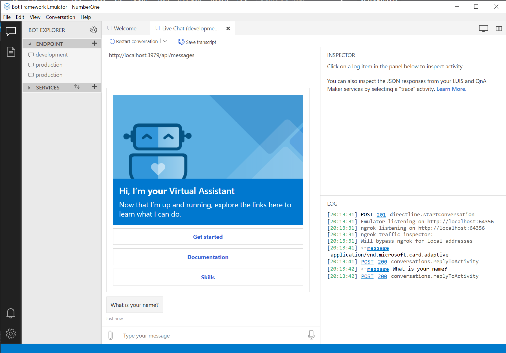

# Quickstart: Creating your first Virtual Assistant (C#)

**APPLIES TO:** ✅ SDK v4

## In this tutorial
- [Intro](#intro)
- [Download and install](#download-and-install)
- [Create your assistant](#create-your-assistant)
- [Deploy your assistant](#deploy-your-assistant)
- [Run your assistant](#run-your-assistant)
- [Next steps](#next-steps)

## Intro
### Purpose

Install Bot Framework development prerequisites and create your first Virtual Assistant.

### Prerequisites

[Download and install](#download-and-install) the Bot Framework development prerequisites.

- Retrieve your LUIS Authoring Key
   - Review the [LUIS regions](https://docs.microsoft.com/en-us/azure/cognitive-services/luis/luis-reference-regions) documentation page for the correct LUIS portal for the region you plan to deploy to. Note that www.luis.ai refers to the US region and an authoring key retrieved from this portal will not work within a europe deployment. 
   - Once signed in replace your name in the top right hand corner.
   - Choose Settings and make a note of the Authoring Key for the next step.

### Time to Complete

10 minutes

### Scenario

A Virtual Assistant app (in C#) that greets a new user.

## Download and install

> It's important to ensure all of the following prerequisites are installed on your machine prior to attempting deployment otherwise you may run into deployment issues.

1. Download and install the [Virtual Assistant Template](https://botbuilder.myget.org/F/aitemplates/vsix/VirtualAssistantTemplate.d2246051-7779-4196-af1f-ae7e2562ec8e-4.4.0.vsix).
2. Download and install [.NET Core SDK](https://www.microsoft.com/net/download).  
3. Download and install [Node Package manager](https://nodejs.org/en/).
4. Download and install PowerShell Core version 6 (required for cross platform deployment support):
   * [Download PowerShell Core on Windows](https://aka.ms/getps6-windows)
   * [Download PowerShell Core on macOS and Linux](https://aka.ms/getps6-linux)
5. Download and install the Bot Framework (CLI) tool dependencies. It's important to do this even if you have earlier versions as the Virtual Assistant makes use of the latest capabilities: 
   ```
   npm install -g botdispatch ludown luis-apis qnamaker luisgen
   ```
6. Download and install the [Azure Command Line Tools (CLI)](https://docs.microsoft.com/en-us/cli/azure/install-azure-cli-windows?view=azure-cli-latest).
7. Download and install the [Bot Framework Emulator](https://aka.ms/botframework-emulator).

## Create your assistant

1. In Visual Studio, replace **File > New Project**.
2. Under Bot, select **Virtual Assistant Template**.
3. Name your project and replace **Create**.
4. Build your project to restore the NuGet packages.

You now have your own Virtual Assistant! Before trying to run your assistant locally, continue with the deployment steps (it creates vital dependencies requires to run correctly).

## Deploy your assistant

The Virtual Assistant requires the following Azure dependencies to run correctly. These are created through an [ARM (Azure Resource Manager)](https://azure.microsoft.com/en-us/features/resource-manager/) script (you can modify this to meet your requirements).

- Azure Web App
- Azure Storage Account (Transcripts)
- Azure Application Insights (Telemetry)
- Azure CosmosDb (State)
- Azure Cognitive Services - Language Understanding
- Azure Cognitive Services - QnAMaker (including Azure Search, Azure Web App)

> Review the pricing and terms for the services and adjust to suit your scenario.

Deploy your services following the steps in [Virtual Assistant and Skill Template deployment](/docs/tutorials/assistantandskilldeploymentsteps.md).

## Run your assistant
When deployment is complete, you can run your Virtual Assistant debugging through the following steps:
1. Press **F5** within Visual Studio to run your assistant.
2. Run the **Bot Framework Emulator**. 
3. Select **Open Bot**.
  <p align="center">
  
  </p>

4. Populate the fields in the **Open a Bot** modal with your bot's configuration settings. Provide the endpoint of your running bot, e.g: `http://localhost:3978/api/messages`. Provide the AppId and Secret values. Find these in your `appsettings.json` file, under the `microsoftAppId` and `microsoftAppPassword` configuration settings.
  <p align="center">
  
  </p>

5. Congratulations, you've built and run your first Virtual Assistant!
<p align="center">

</p>

## Next Steps

Now that you've got the basics, continue [customizing your Virtual Assistant](/docs/tutorials/typescript/customizeassistant.md).