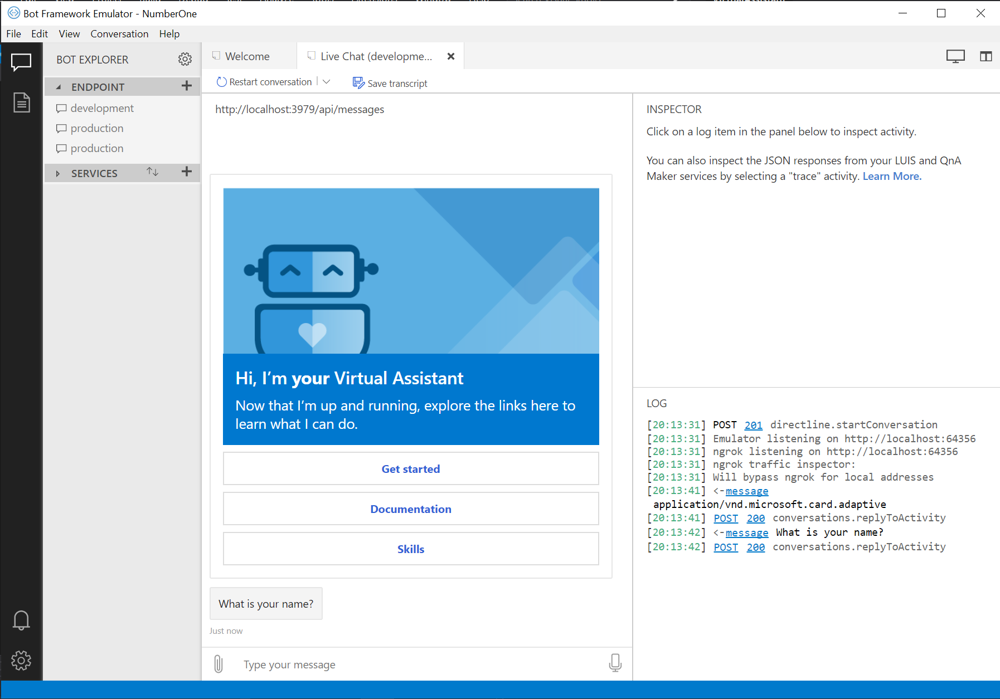

# Quickstart: Creating your first Virtual Assistant (C#)

**APPLIES TO:** ✅ SDK v4

## Table of Contents
- [Intro](#intro)
- [Create your assistant](#create-your-assistant)
- [Deploy your assistant](#deploy-your-assistant)
- [Run your assistant](#run-your-assistant)

## Intro
### Purpose

Install Bot Framework development prerequisites and create your first Virtual Assistant.

### Prerequisites

> It's important to ensure all of the following prerequisites are installed on your machine prior to attempting deployment otherwise you may run into deployment issues.

1. Download and install the [Node Package Manager (NPM)](https://nodejs.org/en/).
2. Download and install PowerShell Core version 6 (required for cross platform deployment support)
   * [Download PowerShell Core on Windows](https://aka.ms/getps6-windows)
   * [Download PowerShell Core on macOS and Linux](https://aka.ms/getps6-linux)
3. Download and install Bot Framework (CLI) tool dependencies. It's important to do this even if you have earlier versions as the Virtual Assistant makes use of the latest capabilities: 
   ```
   npm install -g botdispatch, ludown, luis-apis, qnamaker, luisgen
   ```
4. Install [Yeoman](http://yeoman.io)
   ```
   npm install -g yo
   ```
5. Install the [Azure Command Line Tools (CLI)](https://docs.microsoft.com/en-us/cli/azure/install-azure-cli-windows?view=azure-cli-latest)
6. Retrieve your LUIS Authoring Key
   - Review the [LUIS regions](https://docs.microsoft.com/en-us/azure/cognitive-services/luis/luis-reference-regions) documentation page for the correct LUIS portal for the region you plan to deploy to. Note that www.luis.ai refers to the US region and an authoring key retrieved from this portal will not work within a europe deployment. 
   - Once signed in click on your name in the top right hand corner.
   - Choose Settings and make a note of the Authoring Key for the next step.

### Time to Complete

10 minutes

### Scenario

A Virtual Assistant app (in TypeScript) that greets a new user.

## Create your assistant

>//Temporary ahead of package publishing>

- Clone the [Microsoft AI](https://github.com/Microsoft/AI) repository
- Go to `templates\Virtual-Assistant-Template\typescript\generator-botbuilder-assistant` folder in a command line
- Run npm link to symlink the package folder
>//

Now you can execute the Virtual Assistant generator with this command.

```bash
yo botbuilder-assistant
```

**At this point you have two different options to proceed:**

### Generate the assistant using prompts

- The generator will start prompting for some information that is needed for generating the sample:
    - `What's the name of your assistant? (customAssistant)`
        > The name of your assistant (used also as your project's name and for the root folder's name).
    - `What's the description of your assistant? ()`
        > The description of your assistant.
    - `Which languages will your assistant use? (by default takes all the languages)`
        - [x] Chinese (`zh`)
        - [x] Deutsch (`de`)
        - [x] English (`en`)
        - [x] French (`fr`)
        - [x] Italian (`it`)
        - [x] Spanish (`es`)
    - `Do you want to change the new assistant's location?`
        > A confirmation to change the destination for the generation.
        - `Where do you want to generate the assistant? (by default takes the path where you are running the generator)`
            > The destination path for the generation.
    - `Looking good. Shall I go ahead and create your new assistant?`
        > Final confirmation for creating the desired assistant.

### Generate the sample using CLI parameters

| Option                            | Description                                                                                                  |
|-----------------------------------|--------------------------------------------------------------------------------------------------------------|
| -n, --assistantName <name>              | name of new assistant (by default takes `customAssistant`)                                                          |
| -d, --assistantDesc <description>       | description of the new assistant (by default takes ``) |
| -l, --assistantLang <array of languages>| languages for the new assistant. Possible values are `de`, `en`, `es`, `fr`, `it`, `zh` (by default takes all the languages)| 
| -p, --assistantGenerationPath <path>    | destination path for the new assistant (by default takes the path where you are running the generator)            |
| --noPrompt                        | indicates to avoid the prompts                                                                               |

**NOTE:** If you don't use the _--noPrompt_ option, the process will keep prompting, but using the input values by default.

#### Example

```bash
> yo botbuilder-assistant -n "Virtual Assistant" -d "A description for my new assistant" -l "en,es" -p "\aPath" --noPrompt
```

After this, you can check the summary in your screen:
```bash
- Name: <aName>
- Description: <aDescription>
- Selected languages: <languages>
- Path: <aPath>
```

>**WARNING:** The process will fail if it finds another folder with the same name of the new assistant.

>**NOTE:** Remind to have an **unique** assistant's name for deployment steps. 

You now have your own Virtual Assistant! Before trying to run your assistant locally, continue with the deployment steps (it creates vital dependencies requires to run correctly).

## Deploy your assistant

The Virtual Assistant requires the following Azure dependencies to run correctly. These are created through an [ARM (Azure Resource Manager)](https://azure.microsoft.com/en-us/features/resource-manager/) script (you can modify this to meet your requirements).

- Azure Web App
- Azure Storage Account (Transcripts)
- Azure Application Insights (Telemetry)
- Azure CosmosDb (State)
- Azure Cognitive Services - Language Understanding
- Azure Cognitive Services - QnAMaker (including Azure Search, Azure Web App)

> Review the pricing and terms for the services and adjust to suit your scenario.

Deploy your services following the steps in [Virtual Assistant and Skill Template deployment](/docs/tutorials/assistantandskilldeploymentsteps.md).

## Run your assistant
When deployment is complete, you can run your Virtual Assistant through the following steps:
1. Open the generated assistant in your desired IDE (e.g Visual Studio Code).
2. Run `npm run start`.
2. Run the **Bot Framework Emulator**. 
3. Select **Open Bot**.

4. Populate the fields in the **Open Bot** modal with your bot's configuration settings:
  - Provide the endpoint of your running bot, e.g: `http://localhost:3978/api/messages`
  - Provide the AppId and Secret values. Find these in your `appsettings.json` file, under the `microsoftAppId` and `microsoftAppPassword` configuration settings.
  

Congratulations, you've built and run your first Virtual Assistant!



Now that you've got the basics, continue [customizing your Virtual Assistant](/docs/tutorials/typescript/customizeassistant.md).