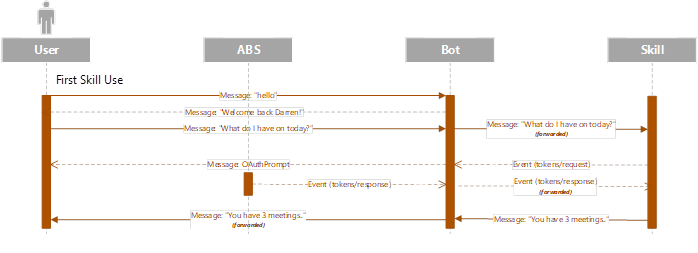
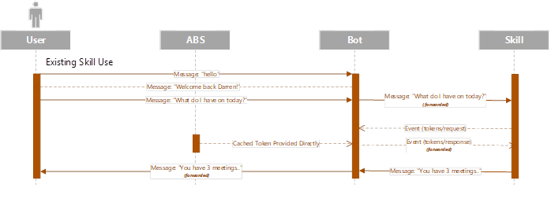

# Virtual Assistant Skills Authentication

To ensure a standardised user experience across all Skills, the Bot is responsible for managing token requests. This helps to ensure that tokens common across multiple skills can be shared and the user isn’t prompted to authenticate for every skill.

The approach mirrors that of the eventing approach used by the Azure Bot Service today.

When a token isn’t already cached (e.g. first time use) the following flow occurs:
- When a Skill requests a Token it asks the calling Bot for a token using an event called tokens/request. 
- The Skill then starts a EventPrompt waiting for a Event to be returned called tokens/response

- The Bot then makes use of the native OAuthPrompt capabilities to surface a prompt to the user
- When a Token is retrieved it’s returned to the Bot within a tokens/response message which is used to complete the OAuthPrompt and store the token securely.
- This same event is then forwarded to the Skill through the existing SkillDialog on the stack and provides the Token for the Skill to use.

Subsequent activations benefit from the Azure Bot Service provided cache and enables silent retrieval of a token.

# Implementing Authentication with your Skill

When developing your Skill you can use Authentication in the conventional way which will ease testing. When your ready to add Skill support for Authentication see the Authentication section of the [Create a new Skill](../../skills/README.md#skills) documentation.