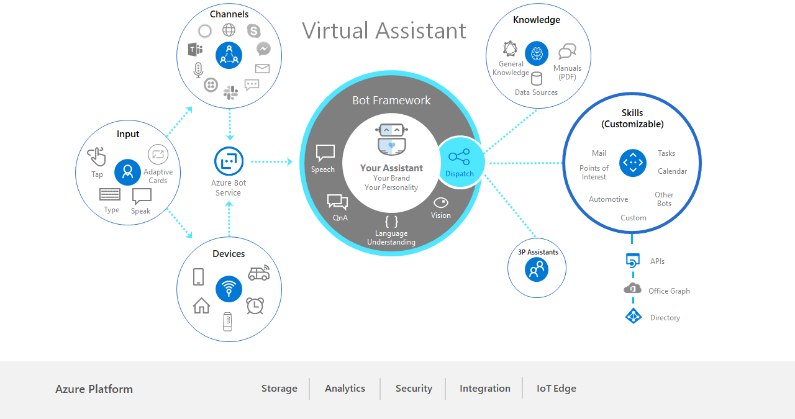

# Virtual Assistant Solution



Customers and partners have a significant need to deliver a conversational assistant tailored to their brand, personalized to their users, and made available across a broad range of canvases and devices. Continuing Microsoft's open-sourced approach towards the [Bot Framework](http://aka.ms/botframework) SDK, the open-source Virtual Assistant solution provides you with a set of core foundational capabilities and full control over the end user experience. 

Owning and enriching customer relationships and insights is vital to the goals of the Virtual Assistant. You can modify the name, voice, and personality to suit a customer’s needs. The solution simplifies the creation of a Virtual Assistant, enabling you to get started in minutes and extend with end-to-end development tooling.

Common scenarios are provided as reusable conversational Skills, increasing developer productivity and enabling a vibrant ecosystem of reusable scenarios. Individual Skills can be added to an existing conversational application like: finding a point of interest, checking off an item on a to-do list, or replying to an email. Skills are fully customizable and consist of language models for multiple languages, dialogs, and code.

Please read the [overview](../common/overview.md) for more on the Virtual Assistant architecture and principles.

## Table of Contents
- [Virtual Assistant Solution](#virtual-assistant-solution)
  - [Table of Contents](#table-of-contents)
  - [Getting Started](#getting-started)
  - [Testing](#testing)
  - [Deployment](#deployment)
  - [Known Issues](#known-issues)
  - [Dive In](#dive-in)
    - [Skills](#skills)
    - [Solution](#solution)

## Getting Started
[Getting started with the Virtual Assistant](./gettingstarted.md) walks you through building, configuring, and deploying your own Virtual Assistant.

## Testing
[Testing your Virtual Assistant](./testing.md) is incredibly important for validating conversational flows and ensuring your Virtual Assistant can run smoothly with a chosen client.

## Deployment

Navigate in a command prompt to the `solutions\Virtual-Assistant\src\csharp\assistant` folder, then update your Virtual Assistant’s Skill and Dispatch language models with the following PowerShell script:

```
...pwsh.exe -ExecutionPolicy Bypass -File DeploymentScripts\update_published_models.ps1
```

By default, this will update all domain models for all language configuration files in your `LocaleConfigurations` folder. If you want to update a specific file for a specific language, add the `-locales` parameter.

```
...pwsh.exe -ExecutionPolicy Bypass -File DeploymentScripts\update_published_models.ps1 -locales "en-us"
```

This script updates your published models and saves the previous version with the id `backup`. In case of any issues with the updates models, you can revert your changes by making `backup` the active version in the LUIS portal.

## Known Issues

See an up-to-date list of frequently asked questions at [Known Issues](./knownissues.md).

## Dive In

The Virtual Assistant builds on the core [Enterprise Template](../../../templates/Enterprise-Template/README.md) capabilities providing base conversational intents in multiple languages, Dispatching, QnA and conversational analytics.

### Skills
Name | Description |
:---:  | -------------
[Overview](../../skills/csharp/README.md) | A broad set of common capabilities exist which today, which require each developer to build themselves. Our Virtual Assistant solution includes a new Skill capability enabling new capabilities to be plugged into an Virtual Assistant through configuration only and provide an authentication mechanism for Skills to request tokens for down-stream activities.
[Create a new Skill](../../skills/csharp/create.md) | The Skill Template provides an out-of-the-box basic Skill and unit test project, which can be customized to a new scenario. |
[Developing a new Skill](../../skills/csharp/developing-a-new-skill.md) |Use the best practices in language understanding, conversational design, and dialog code development to provide a high quality Skill.|
[Calendar Skill](../../skills/csharp/productivity-calendar.md) | The *preview* Skill provides a comprehensive language model for common calendar related activities, The Skill is currently integrated into Microsoft Graph (Office 365/Outlook.com) and Google APIs.
[Email Skill](../../skills/csharp/productivity-email.md) | The *preview* Skill provides a comprehensive language model for common email related activities, The Skill is currently integrated into Microsoft Graph (Office 365/Outlook.com) and Google APIs.
[ToDo Skill](../../skills/csharp/productivity-todo.md) | The *preview* Skill provides a comprehensive language model for common task related activities, The Skill is currently integrated into Microsoft Graph (outlookTask) and Google APIs.
[Point of Interest Skill](../../skills/csharp/pointofinterest.md) | The *preview* Skill provides a comprehensive language model for finding points of interest and requesting directions. The Skill currently provides integration into Azure Maps and Foursquare.
[Automotive Skill](../../skills/csharp/automotive.md) | The *preview* Skill provides Vehicle Setting control support for an assistant along with an initial set of common vehicle settings which can be extended further. At this time the Skill surfaces device events to demonstrate how device control could be achieved.
[Experimental Skills](../../skills/common/experimental-skills.md) | Experimental Skills are early prototypes of Skills to help bring Skill concepts to life for demonstrations and proof-of-concepts along with providing different examples to get you  started. Restaurant Booking and News Skills are currently available.

### Solution
Name | Description |
:---:  | -------------
[Personalization](./personalization.md) | Highlights highlights the key components of the Virtual Assistant solution that need to be modified to provide a customized implementation. |
[Eventing Architecture](./events.md) | Events in the context of the Virtual Assistant enable a client application (in a web-browser or on a device such as a car or speaker) to exchange information about the user or device events whilst also receiving events to perform device operations.
[Linked Accounts](./linkedaccounts.md) | In a speech-led scenario, it is not practical for a user to enter their credentials for supporting systems through voice commands. Therefore a separate companion experience provides an opportunity for the user to sign in and provide permissions to a Virtual Assistant for continued use.
[Device Integration](../common/deviceintegration.md) | Our Azure Bot Service SDKs (Direct Line) along with Adaptive Card and Speech SDKs enable easy cross platform integration to devices. Additional device integration examples and platform including Edge are planned.
[Test Harnesses](./testing.md) | In addition to the Bot Framework Emulator, a WebChat based test harness is provided enabling more complex authentication scenarios to be tested. A simple Console based test harness demonstrates the approach to exchange messages to help frame the ease of device integration.
[Automated Deployment](./gettingstarted.md) | All the Azure resources required for your Assistant are automatically deployed: [Bot Service](http://aka.ms/botservice) registration, [Azure App Service](https://azure.microsoft.com/en-us/services/app-service/), [LUIS](https://luis.ai/), [QnAMaker](https://qnamaker.ai/), [Content Moderator](https://aka.ms/contentmoderator), [CosmosDB](https://aka.ms/cosmosdb), [Azure Storage](https://azure.microsoft.com/en-us/services/storage/), and [Application Insights](http://aka.ms/appinsights). Additionally, LUIS models for all Skills, QnAMaker, and Dispatch models are created, trained, and published to enable immediate testing.
[Conversational Analytics](/solutions/analytics/README.md) | Analytics surfacing insights into end user activity, dialog/skill usage, quality and gaps in knowledge.
[Authentication](../common/authentication.md) | The Assistant and associated Skills often need access to end-user authentication tokens in order to perform operations on behalf of the user. <br /> <br /> OAuth authentication providers are supported by the Azure Bot Service and provide the ability for you to configure providers such as Active Directory (for Office 365), Facebook or your own. |
Language Support | Natural Language Understanding is at the core of a Virtual Assistant. The LUIS Cognitive Service is used throughout the Virtual Assistant and Skills hence you can refer to the [LUIS supported languages](https://docs.microsoft.com/en-us/azure/cognitive-services/luis/luis-supported-languages) to understand the foundational language availability at this time. <br/><br/> In-line with customer prioritization we have prioritized English, French, Italian, German,  Spanish and Chinese languages for the language models made available through the Virtual Assistant along with the Language Generation (responses). Additional language support is in planning and can be prioritized according to customer demand. |
Assistant Middleware | ◾ Telemetry Middleware leverages Application Insights to store telemetry for incoming messages, LUIS results, and QnA activities. Power BI can then use this data to surface conversational insights. <br />   ◾ Event Processing Middleware processes events sent by the device <br />◾ Content Moderator Middleware uses the Content Moderator Cognitive Service to detect inappropriate / PII content|
Dispatcher | The Dispatcher is trained across a variety of Natural Language data sources to provide a unified NLU powered dispatch capability. LUIS models from the Assistant, each configured Skill and questions from QnAMaker are all ingested as part of the dispatcher training process. This training process can also provide evaluation reports to identify confusion and overlap. <br/><br/> This training process creates a Dispatcher LUIS model which is then used by the Assistant to identify the component that should handle a given utterance. When a dialog is active the Dispatcher model is only used to identify top level intents such as Cancel for interruption scenarios. |
Edge Enablement | Many assistant scenarios require cloud-connectivity to access down-stream APIs or data sources (e.g. Office 365, Navigation data, Music Services, etc.). There are however a class of assistant scenarios especially those running on devices that may have periods of poor connectivity where pushing speech, language processing and dialog management onto the edge (device) is needed.<br/><br/> We have a number of options to address this depending on platform and are working with initial customers to deliver this capability|
Dialogs | Dialogs represent conversational topics that the Assistant can handle. The `SkillDialog` is provided with the Virtual Assistant to handle the invocation of Skills based on the Dispatcher identifying an utterance should be passed to a Skill. Subsequent messages are routed to the Active dialog for processing until the dialog has ended.<br/><br/><br/><br/>Skills at this time are invoked *in-process* through activating the Skill in an accompanying assembly file. <br/><br/>An in-process Bot Framework adapter ensures the bot communication protocol is utilised for Skill messaging. |
Client Integration | End-Users can make use of the Virtual Assistant through the support Azure Bot Service Channels or through the Direct Line API that provides the ability to integrate your assistant directly into a device, mobile app or any other client experience. Device integration requires the creation of a lightweight host app which runs on the device. We have successfully built native applications across multiple embedded platforms including HTML5 applications.<br/><br/>The host app is responsible for the following capabilities. These can, of course, be extended depending on the device capabilities. <br/> ◾ Open and closing the microphone as indicated through the InputHint on messages returned by the Assistant  <br/>  ◾ Audio playback of responses created by the Text-to-Speech service  <br/>  ◾ Rendering of Adaptive Cards on the device through a broad range of renderers supplied with the Adaptive Cards SDK  <br/>◾ Processing events received from the Assistant, often to perform on-device operations (e.g. change navigation destination)  <br/> ◾ Accessing the on-device secret store to store and retrieve a token for communication with the assistant  <br/>◾ Integration with the Unified Speech SDK where on-device speech capabilities are required  <br/>◾ Interface to the Direct-Link REST API or SDKs  <br/>◾ Authenticating the end user of the device and providing a unique userId to the Assistant. Microsoft has capabilities to help with this if needed. |
