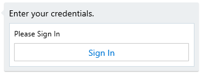
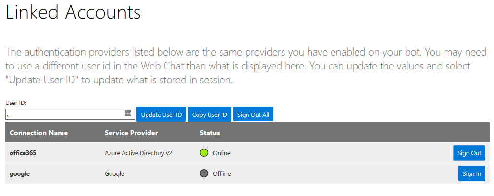

# Linking Accounts to a Virtual Assistant

## Overview

Speech-led conversational scenarios require a different mindset and approach for certain scenarios, 
one such example is [Authentication](../common/authentication.md). 
If you take a Productivity scenario, whereby the user wants to access information in their calendar it's important 
for the VA Bot to have access to a security token (Office 365 for example). 

The first time this scenario executes the Virtual Agent needs to prompt a user for authentication. When using WebChat, this is normally 
done by returning an OAuthCard to the user along with a Button linking to an OAuth authentication page as shown below. 
If you'd like to learn more about this scenario in WebChat, we encourage you to read [Sign-In experiences](https://blog.botframework.com/2018/08/28/sign-in-experiences/) on the Bot Framework Blog.

**OAuth Card Example**



In a speech-led scenario, it's unacceptable and impractical to expect a user to enter their username and password through voice command. Therefore, a separate companion experience would provide the opportunity for a user to sign in once and provide permissions for the Virtual Assistant to retrieve a token for later continued use.

The Linked Accounts feature of the Virtual Assistant provides a reference sample of a web app using the Azure Bot Service to deliver this capability, a screen shot showing the example interface is shown below and demonstrates the type of capability you would build into your own experience (e.g. a mobile app)



## Authentication Configuration

In order to perform Account Linking, the Linked Accounts web app will need the end user to login using the same account as they'll use to authenticate as a user of your Virtual Assistant, for example `darren@contosoassistant.com`. This is required to retrieve the unique identifier of the user which is used as the **key** to retrieving any linked token in the future.

The ``appsettings.json`` file in the LinkedAccounts sample project has the following OAuth configuration entry for you to complete, the default example is for a microsoftonline.com based scenario. You can replace this with any custom authentication solution you have, what is key is ensuring the Linked Accounts feature is authenticating the user in some way and retrieving the same unique identifier which is passed to the assistant in future conversations.

### Integrating Azure AD

1. Sign in to the [Azure Portal](https://portal.azure.com/).
2. On the left sidebar, select  **Azure Active Directory**.
3. From the sidedbar within, select **App Registrations (Preview)**.
4. Select **New registration**
   *  **Name**: *Provide a friendly name*
   *  **Redirect URI**: `http://localhost:XXXX/signin-oidc` *(update with the local port of your project or replace with the address of your deployed website*
   *  Click Register
5. Select the Authentication section of your newly created application
   *  Select `ID tokens` under the Implicit grant section
6. On the **Overview** page of your new app, copy the following values into your `appsettings.json`
   * `Directory (tenant) ID` maps to `TenantId`
   * `Application (client) ID` maps to `ClientId`

```
"AzureAd": {
    "Instance": "https://login.microsoftonline.com/",
    "Domain": "microsoft.onmicrosoft.com",
    "TenantId": "YOUR_TENANTID",
    "ClientId": "YOUR_CLIENTID",
    "CallbackPath": "/signin-oidc"
  }
```

> **Note** This should enable MSA accounts to be linked as well, but your provider may prevent that as a default. You can go to **Users** > **New guest user** to add additional accounts.

This sample uses the AD Object Identifier claim (``AadObjectidentifierClaim``) as the unique user identifier when performing token operations. This needs to be the same user identifier used by the Virtual Assistant when requesting tokens. 

In order to manage account linking and securely store authentication tokens, the web app requires access to your bot's ApplicationId and Secret which you provide through the following configuration settings.
```
"MicrosoftAppId": "YOUR_BOT_APPLICATIONID",
"MicrosoftAppPassword": "YOUR_BOT_APPLICATION_SECRET" 
```
  
The final configuration is the Direct Line secret for your Virtual Assistant bot. This is required to avoid prompts for magic codes, otherwise required to protect against man-in-the-middle attacks. 
Exchanging a Direct Line secret for a Token and providing a Trusted Origin enables removal of the magic code step.

> Your VA Bot will need to be deployed and have a Direct Line channel configured within the Azure portal

```
  "ClientDirectLineSecret": "YOUR_DIRECTLINE_SECRET",
```
## Testing Linked Accounts

If you run the project within Visual Studio you will be navigated to the Linked Accounts web app. 
You'll be prompted to login, use the same credentials that your Virtual Assistant will be using when performing operations on your behalf thus ensuring the underlying unique identifier matches.

> If different accounts are used then your assistant Bot will not have access to your linked tokens and may prompt for authentication.
Once logged in you, click Linked Accounts in the top navigation page and you should see a list of the Authentication connections configured for the Bot 
(whose MicrosoftAppId you specified in the earlier configuration step).

You can now click Sign-In to be navigated to the respective OAuth sign-in page. Once complete the Linked Accounts web app should show a green linked status.

## Testing your Virtual Assistant with Linked Accounts

Now that you've linked your account and stored tokens you can move back to your Virtual Assistant and check that it's able to use the tokens you've stored and not prompt for authentication.

> Note that when communicating with the Virtual Assistant (Bot) the From.Id property on each Activity must be populated with the same User unique-identifier as this is the *key* used by the Authentication logic to retrieve tokens. 
> The Linked Accounts website sample uses the [objectidentifier](https://docs.microsoft.com/en-us/azure/architecture/multitenant-identity/claims) claim and this must be used by your Virtual Assistant client app or Test Harnesses. 
> Equally, the principal name (upn) could be used if preferred.

Asking a question that triggers a user flow which requires the specified token should now not prompt for authentication.

The Bot Framework Emulator currently generates a unique UserId which can be changed to a new unique ID by clicking the down arrow next to the Restart Conversation button and choosing 'Restart with new UserId'. Unfortunately there is no current way to specify a UserId and therefore match the `AadObjectidentifierClaim` associated with your user account for use which blocks Emulator testing. At this time we have provided the ability in Linked Accounts to override the UserId enabling you to pass in the UserId currently in use by the Emulator. You can view the User identified being used by the emulator by sending a message and clicking on the entry in the log window and retrieving the from.id value.
```
  "from": {
    "id": "USERID_IN_USE_HERE",
    "role": "user"
  },
```