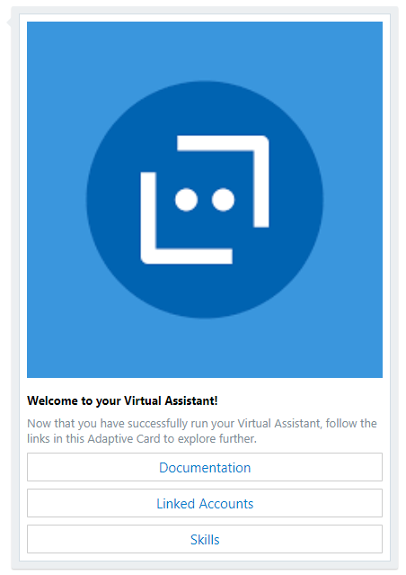
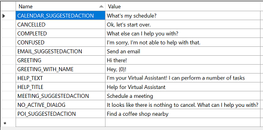
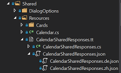
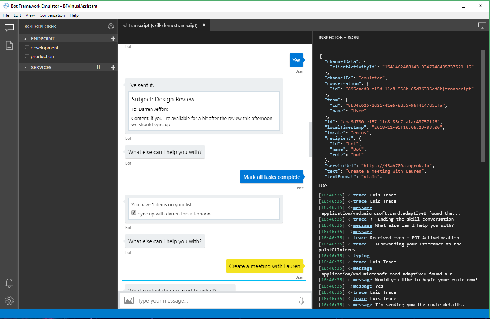

# Personalizing the Virtual Assistant

While the Virtual Assistant Solution provides out-of-the-box functionality to demonstrate an end-to-end experience, it is often wise to customize key components that can tailor to your audience.
To get started, learn how to clone the repository & deploy your Azure resources by reading [Getting Started With the Virtual Assistant](./gettingstarted.md).

## Table of Contents
- [Project Structure](#project-structure)
- [Introduction](#update-the-introduction)
- [Virtual Assistant Responses](#update-virtual-assistant-responses)
- [Skill Responses](#update-the-skill-responses)
- [FAQ](#update-the-faq-with-qnamaker)
- [Add a new QnAMaker knowledge base](#adding-an-additional-qnamaker-knowledgebase)
- [Demo](#demoing-the-skills) 

## Project Structure

The folder structure of your Virtual Assistant is shown below.

    | - Assistant                           // Directory for the core Virtual Assistant
        | - YOURBOT.bot                     // The .bot file containing all of your Bot configuration including dependencies
        | - README.md                       // README file containing links to documentation
        | - Program.cs                      // Default Program.cs file
        | - Startup.cs                      // Core Bot Initialisation including Bot Configuration LUIS, Dispatcher, etc.
        | - appsettings.json                // References above .bot file for Configuration information. App Insights key
        | - CognitiveModels
            | - LUIS                        // .LU files containing base conversational intents (Greeting, Help, Cancel)
            | - QnA                         // .LU files containing example QnA items
        | - DeploymentScripts               // msbot clone recipe for deployment
        | - Dialogs                         // Main dialogs sit under this directory
            | - Main                        // Root Dialog for all messages
                | - MainDialog.cs           // Dialog Logic
                | - MainResponses.cs        // Dialog responses
                | - Resources               // Adaptive Card JSON, Resource File
            | - Onboarding
                | - OnboardingDialog.cs     // Onboarding dialog Logic
                | - OnboardingResponses.cs  // Onboarding dialog responses
                | - OnboardingState.cs      // Localised dialog state
                | - Resources               // Resource File
            | - Cancel
            | - Escalate
            | - Signin
        | - Middleware                      // Telemetry, Content Moderator
        | - ServiceClients                  // SDK libraries, example GraphClient provided for Auth example
    | - Skills                              // Directory for the Virtual Assistant skills
        | - CalendarSkill
        | - EmailSkill
        | - PointOfInterestSkill
        | - Tests
        | - ToDoSkill

## Update the Introduction

When a new conversation is started with a Virtual Assistant, it receives a `ConversationUpdate` Activity and begins the `MainDialog`. 
The first Activity the Virtual Assistant will send displays an introduction card, which is found under [/assistant/Dialogs/Main/Resources](https://github.com/Microsoft/AI/tree/master/solutions/Virtual-Assistant/src/csharp/assistant/Dialogs/Main/Resources). 
The introduction is presented with an [Adaptive Card](https://adaptivecards.io/), where UX elements can be defined once and rendered appropriate to your client. You can copy the JSON below and paste in in [Adaptive Cards Designer](https://adaptivecards.io/designer/) to experiment with yourself.



```
{
  "$schema": "http://adaptivecards.io/schemas/adaptive-card.json",
  "type": "AdaptiveCard",
  "version": "1.0",
  "speak": "Welcome to your Virtual Assistant! Now that you're up and running, let's get started.",
  "body": [
    {
      "type": "Image",
      "url": "https://encrypted-tbn0.gstatic.com/images?q=tbn:ANd9GcQtB3AwMUeNoq4gUBGe6Ocj8kyh3bXa9ZbV7u1fVKQoyKFHdkqU",
      "size": "stretch"
    },
    {
      "type": "TextBlock",
      "spacing": "medium",
      "size": "default",
      "weight": "bolder",
      "text": "Welcome to **your** Virtual Assistant!",
      "speak": "Welcome to your Virtual Assistant",
      "wrap": true,
      "maxLines": 0
    },
    {
      "type": "TextBlock",
      "size": "default",
      "isSubtle": "yes",
      "text": "Now that you have successfully run your Virtual Assistant, follow the links in this Adaptive Card to explore further.",
      "speak": "Now that your up and running let's get started.",
      "wrap": true,
      "maxLines": 0
    }
  ],
  "actions": [
    {
      "type": "Action.OpenUrl",
      "title": "Documentation",
      "url": "https://aka.ms/customassistantdocs"
    },
    {
     "type": "Action.OpenUrl",
      "title": "Linked Accounts",
      "url": "https://github.com/Microsoft/AI/blob/master/solutions/Virtual-Assistant/docs/customassistant-linkedaccounts.md"
    },
    {
      "type": "Action.OpenUrl",
      "title": "Skills",
      "url": "https://github.com/Microsoft/AI/blob/master/solutions/Virtual-Assistant/docs/customassistant-skills.md"
    }
  ]
}
```

## Update Virtual Assistant Responses

Ahead of the new Language Generation capabilities the Virtual Assistant makes use of Resource Files (RESX) for all base assistant responses. These are defined at the dialog level and can be found within the Resources folder of the corresponding Dialog within the Dialogs folder.

The `Main\Resources` folder contains responses shared across the Virtual Assistant. All resource files are localised with a separate language version as denoted by the locale suffix. For example `MainStrings.rex" under Main contains english responses with mainstrings.es containing spanish and so-on.

The in-built Visual Studio resource file editor makes it easy to apply changes to suit your Virtual Assistant scenario. Once you make changes, rebuild your project for them to take effect and ensure you update the localised versions as appropriate for your scenario.



## Update the Skill responses

The Skills make use of [T4 Text Templating](https://docs.microsoft.com/en-us/visualstudio/modeling/code-generation-and-t4-text-templates?view=vs-2017) for the more complex Skill response generation. This is ahead of the new Language Generation capabilities that we will move to when ready.

You may wish to change the Skill responses to better suit your scenario and apply a different personality to all responses. This can be performed by changing the appropriate JSON file representing each dialogs responses. 

You can achieve this by updating the appropriate JSON file, for example as shown these can be found within the Resources folder of the corresponding Dialog. You will need to expand the corresponding TT file and JSON file to see all of the language variations.



An except of the `CreateEventDialog` responses files is shown below. In this case the `NoLocation` response surfaced to the Dialog code has a `Text` display and `Speak` variant enabling the client to select the most appropriate response for the users context (e.g. text versus speech led). 

In addition the [`inputHint`](https://docs.microsoft.com/en-us/azure/bot-service/dotnet/bot-builder-dotnet-add-input-hints?view=azure-bot-service-3.0) is a hint to the client around microphone control, in this case this text is used for a prompt so the hint is set to expectingInput signaling that the client should automatically open the microphone for the response. If this is not set correctly, the client may inadvertently open the microphone when not needed or cause the user to have to click a speech button to respond.

```
"NoLocation": {
    "replies": [
      {
        "text": "What is the location for the meeting?",
        "speak": "What is the location for the meeting?"
      }
    ],
    "inputHint": "expectingInput"
  }
```
Multiple variations for a response can be provided as shown in the error message response detailed below.
```
 "EventCreationFailed": {
    "replies": [

      {
        "text": "Event creation failed",
        "speak": "Event creation failed"
      },
      {
        "text": "Something went wrong, try again please.",
        "speak": "Something went wrong, try again please."
      },
      {
        "text": "It seems the event could not be created, please try again later.",
        "speak": "It seems the event could not be created, please try again later."
      },
      {
        "text": "Creation of the event failed, please try again.",
        "speak": "Creation of the event failed, please try again."
      },
      {
        "text": "An error occured with creating the event.",
        "speak": "An error occured with creating the event."
      }
    ],
    "inputHint": "expectingInput"
  },
```

Clean and Rebuild your project once changes have been made and ensure you update all localised versions as required for your assistant.

## Update the FAQ with QnAMaker

The FAQ provided features commonly asked questions about the Bot Framework, but you may wish to provide industry-specific samples.

To update an existing QnAMaker Knowledge Base, perform the following steps:
1. Make changes to your QnAMaker Knowledge Base via the [LuDown](https://github.com/Microsoft/botbuilder-tools/tree/master/packages/Ludown) and [QnAMaker](https://github.com/Microsoft/botbuilder-tools/tree/master/packages/QnAMaker) CLI tools leveraging the existing QnA file stored within the `CognitiveModels\QnA` folder of your project or directly through the [QnAMaker Portal](https://qnamaker.ai).
2. Run the following command to update your Dispatch model to reflect your changes (ensures proper message routing):
```shell
    dispatch refresh --bot "YOURBOT.bot" --secret YOUR_SECRET
```

## Adding an additional QnAMaker knowledgebase

In some scenarios you may wish to add an addditional QnAMaker knowledgebase to your assistant, this can be performed through the following steps.

1. Create a new QnAMaker knowledgebase from a JSON file using the following command executed in your assistant directory
```shell
qnamaker create kb --in <KB.json> --msbot | msbot connect qna --stdin --bot "YOURBOT.bot" --secret YOUR_SECRET
```
2. Run the following command to update your Dispatch model to reflect your changes
```shell
    dispatch refresh --bot "YOURBOT.bot" --secret YOUR_SECRET
```
3. Update the strongly typed Dispatch class to reflect the new QnA source
```shell
msbot get dispatch --bot "YOURBOT.bot" | luis export version --stdin | luisgen - -cs Dispatch -o Dialogs\Shared
```
4. Update the `assistant\Dialogs\Main\MainDialog.cs` file to include the corresponding Dispatch intent for your new QnA source following the example provided.

You should now be able to leverage multiple QnA sources as part of your Assistant.

## Demoing the Skills

You can review [sample transcripts](../../transcripts/README.md) showcasing the Productivity & Point of Interest Skills, 
which can be opened in the [Bot Framework Emulator](https://github.com/Microsoft/BotFramework-Emulator/wiki).
This sample conversation shows a user having previously [linked their account](./linkedaccounts.md) and taking advantage of [event debug middleware](./events.md).

