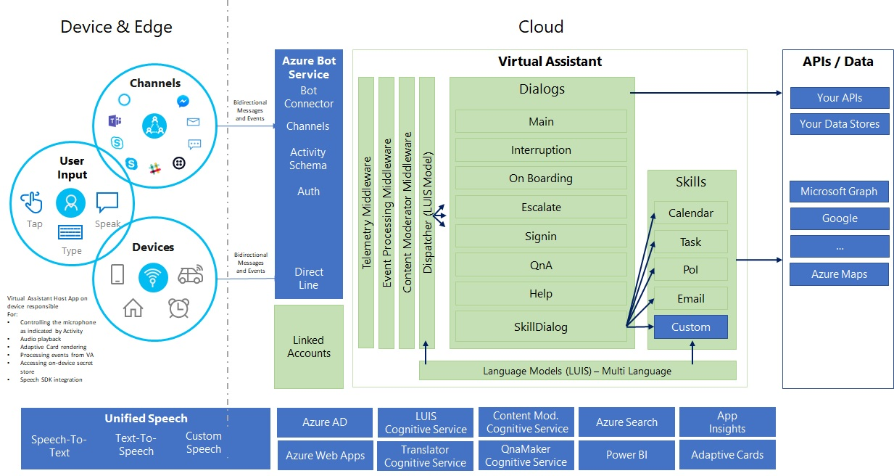

# Virtual Assistant Detailed Overview

## Table of Contents
- [Example Scenarios](#example-scenarios)
- [Architecture](#architecture)
- [Our Principles](#our-principles)

## Example Scenarios

The Virtual Assistant extends across a broad number of industry scenarios, some example scenarios are shown below for reference purposes.

- Automotive Industry
  - Voice enabled Virtual Assistant integrated into the car providing end users the ability to perform traditional car operations (e.g. navigation, radio) along with productivity focused scenarios such as moving meetings when your running late, adding items to your task list and proactive experiences where the car can suggest tasks to complete based on events such as starting the engine, traveling home or enabling cruise control. Adaptive Cards are rendered within the Head Unit and Speech integration performed through Push-To-Talk or Wake Word interactions.

- Hospitality
  - Voice enabled Virtual Assistant integrated into a hotel-room device providing a broad range of Hospitality focused scenarios (e.g. extend your stay, request late checkout, room service) including concierge and the ability to find local restaurants and attractions. Optional linking to your Productivity accounts open up more personalised experiences such as suggested alarm calls, Weather warnings and learning of patterns across stays. An evolution of the current TV personalisation experienced in room today.

- Enterprise
  - Voice and Text enabled branded Employee Assistant experiences integrated into enterprise devices and existing conversation canvases (e.g. Teams, WebChat, Slack) enabling employees to manage their calendars, find available meeting rooms, find people with specific skills or perform HR related operations.

## Architecture

An Architecture diagram of the Virtual Assistant is shown below along with a detailed explanation.

## Our Principles

### Your Data, Brand, and Experience
All aspects of the end user experience are owned and controlled by you. This includes the Branding, Name, Voice, Personality, Responses and Avatar. The source-code to the Virtual Assistant and supporting Skills are provided in full enabling you to adjust as required.

Your Virtual Assistant will be deployed within your Azure subscription. Therefore all data generated by your assistant (questions asked, user behaviour, etc.) is entirely contained within your Azure subscription. See [Cognitive Services Azure Trusted Cloud](https://www.microsoft.com/en-us/trustcenter/cloudservices/cognitiveservices) and the [Azure section of the Trust Center](https://www.microsoft.com/en-us/TrustCenter/CloudServices/Azure) more specifically for more information.

### Write Once, Embed Anywhere
The Virtual Assistant leverages the Microsoft Conversational AI platform and therefore can be surfaced through any Bot Framework [channel](https://docs.microsoft.com/en-us/azure/bot-service/bot-service-manage-channels?view=azure-bot-service-4.0) – e.g. WebChat, FaceBook Messenger, Skype, etc. 

In addition, through the [Direct Line](https://docs.microsoft.com/en-us/azure/bot-service/rest-api/bot-framework-rest-direct-line-3-0-concepts?view=azure-bot-service-4.0) channel we can embed experiences into Desktop and Mobile Apps including devices such as Cars, Speakers, Alarm Clocks, etc.

### Enterprise Grade Solutions
The Virtual Assistant solution is built on the Azure Bot Service, Language Understanding Cognitive Service, Unified Speech along with a broad set of supporting Azure components meaning that you benefit from the [Azure global infrastructure](https://azure.microsoft.com/en-gb/global-infrastructure/) including ISO 27018, HIPPA, PCI DSS, SOC 1,2 and 3 certification.

In addition, Language Understanding support is provided by the LUIS Cognitive Service which supports a broad set of [languages](https://docs.microsoft.com/en-us/azure/cognitive-services/luis/luis-supported-languages). The [Translator Cognitive Service](https://azure.microsoft.com/en-us/services/cognitive-services/translator-text-api/) provides additional Machine Translation capabilities to extend the reach of your Virtual Assistant even further.

### Flexible Integration and Contextually Aware
The Virtual Assistant architecture is flexible and can be integrated with existing investments you have made into device-based Speech or Natural Language processing capabilities and integrate existing back-end systems and APIs.

Not only does the Virtual Assistant enable you to deliver your own unique experience, but you can also also handoff a user's query to their chosen Digital Assistant for certain types of questions.

Your Virtual Assistant can be integrated into your device and ecosystem to enable a truly intelligent experience. 
Through this contextual awareness your Virtual Assistant can deliver a further personalized conversation than otherwise possible.

### Adaptive Cards
[Adaptive Cards](https://adaptivecards.io/) provide the ability for your Virtual Assistant to return user experience elements (e.g. Cards, Images, Buttons) alongside text-based responses. 
If the conversation canvas has a screen these cards can be rendered across a broad range of devices and platforms providing supporting UX where appropriate. 
[Samples of Adaptive Cards](https://adaptivecards.io/samples/) are available to try out, as well as documentation on how to [render cards within your own application](https://docs.microsoft.com/en-us/adaptive-cards/rendering-cards/getting-started).

### Skills
In addition to the core Virtual Assistant, there exists a broad set of common capabilities which require each developer to build themselves. 
Productivity scenarios are a great example where each organisation would need to create their own:
1. Language Models (*LUIS*)
2. Dialogs (*code-based*)
3. API Integration (*code-based*)
4. Language Generation (*bot responses*)

This is then further complicated by the need to support multiple languages and results in a large amount of work required for any organisation building their own assistant.
Our Virtual Assistant solution includes a new Skill capability enabling new capabilities to be plugged into an existing Virtual Assistant through configuration only.

All aspects of each Skill are completely customisable by developers as the full source code is provided on GitHub along with the Virtual Assistant.
