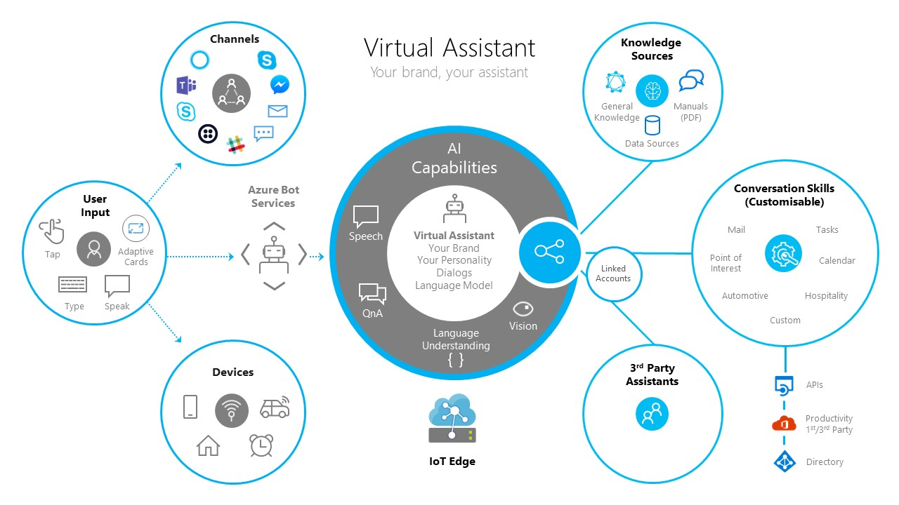

# Virtual Assistant Solution



Customers and partners have a significant need to deliver a conversational assistant tailored to their brand, personalized to their users, and made available across a broad range of canvases and devices. Continuing Microsoft's open-sourced approach towards the [Bot Framework](http://aka.ms/botframework) SDK, the open-source Virtual Assistant solution provides you with a set of core foundational capabilities and full control over the end user experience. 

Owning and enriching customer relationships and insights is vital to the goals of the Virtual Assistant. You can modify the name, voice, and personality to suit a customer’s needs. The solution simplifies the creation of a Virtual Assistant, enabling you to get started in minutes and extend with end-to-end development tooling.

Common scenarios are provided as reusable conversational Skills, increasing developer productivity and enabling a vibrant ecosystem of reusable scenarios. Individual Skills can be added to an existing conversational application like: finding a point of interest, checking off an item on a to-do list, or replying to an email. Skills are fully customizable and consist of language models for multiple languages, dialogs, and code.

Please read the [overview](../common/overview.md) for more on the Virtual Assistant architecture and principles.

## Table of Contents
- [Virtual Assistant Solution](#virtual-assistant-solution)
  - [Table of Contents](#table-of-contents)
  - [Getting Started](#getting-started)
  - [Testing](#testing)
  - [Deployment](#deployment)
  - [Known Issues](#known-issues)
  - [Dive In](#dive-in)
    - [Skills](#skills)
    - [Solution](#solution)

## Getting Started
[Getting started with the Virtual Assistant](./gettingstarted.md) walks you through building, configuring, and deploying your own Virtual Assistant.

## Deployment

Navigate in a command prompt to the `solutions\Virtual-Assistant\src\typescript\assistant` folder, then update your Virtual Assistant’s Skill and Dispatch language models with the following PowerShell script:

```
...pwsh.exe -ExecutionPolicy Bypass -File deploymentScripts\update_published_models.ps1
```

By default, this will update all domain models for all language configuration files in your `LocaleConfigurations` folder. If you want to update a specific file for a specific language, add the `-locales` parameter.

```
...pwsh.exe -ExecutionPolicy Bypass -File deploymentScripts\update_published_models.ps1 -locales "en-us"
```

This script updates your published models and saves the previous version with the id `backup`. In case of any issues with the updates models, you can revert your changes by making `backup` the active version in the LUIS portal.


## Dive In

The Virtual Assistant builds on the core [Enterprise Template](../../../templates/Enterprise-Template/README.md) capabilities providing base conversational intents in multiple languages, Dispatching, QnA and conversational analytics.

### Skills
Name | Description |
:---:  | -------------
[Overview](../../skills/README.md) | A broad set of common capabilities exist which today, which require each developer to build themselves. Our Virtual Assistant solution includes a new Skill capability enabling new capabilities to be plugged into an Virtual Assistant through configuration only and provide an authentication mechanism for Skills to request tokens for down-stream activities.
[Create a new Skill](../../skills/typescript/create.md) | The Skill Template provides an out-of-the-box basic Skill and unit test project, which can be customized to a new scenario. |
[Developing a new Skill](../../skills/typescript/developing-a-new-skill.md) |Use the best practices in language understanding, conversational design, and dialog code development to provide a high quality Skill.|
