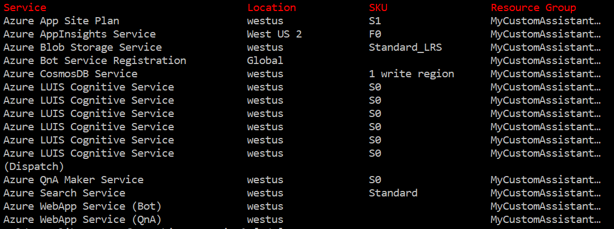

# Virtual Assistant Bot

> [!NOTE]
> This topics applies to v4 version of the SDK.

This bot has been created using [Microsoft Bot Framework](https://dev.botframework.com).

## Table of Contents
- [Virtual Assistant Bot](#virtual-assistant-bot)
    - [Table of Contents](#table-of-contents)
    - [Prerequisites](#prerequisites)
        - [Clone the Repo](#clone-the-repo)
        - [Build the Solution](#build-the-solution)
    - [Deployment](#deployment)
        - [Initial Deployment](#initial-deployment)
        - [Post Deployment Configuration](#post-deployment-configuration)
        - [Final Deployment](#final-deployment)
    - [Testing](#testing)
        - [Testing the bot using Bot Framework Emulator](#testing-the-bot-using-bot-framework-emulator)
    - [Further Reading](#further-reading)
- [Contributing](#contributing)
 
## Prerequisites

> It's important to ensure all of the following pre-requisites are installed on your machine prior to attempting deployment otherwise you may run into deployment issues.

- Ensure the [Node Package manager](https://nodejs.org/en/) is installed.

- Install the PowerShell Core version 6 (Required for cross platform deployment support)
   * [Download PowerShell Core on Windows](https://aka.ms/getps6-windows)
   * [Download PowerShell Core on macOS and Linux](https://aka.ms/getps6-linux)

- Install the Azure Bot Service command line (CLI) tools. It's important to do this even if you've used the tools before to ensure you have the latest versions.

```shell
npm install -g ludown luis-apis qnamaker botdispatch msbot chatdown
```

- Install the latest Azure Command Line Tools (CLI) from [here](https://docs.microsoft.com/en-us/cli/azure/install-azure-cli-windows?view=azure-cli-latest)

- Install or update the LUISGen tool

```shell
dotnet tool install -g luisgen
```
or
```shell
dotnet tool update -g luisgen
```

- Install [Microsoft/Rush](https://www.npmjs.com/package/@microsoft/rush) to manage the VA solution

```shell
npm install -g @microsoft/rush
```

- Retrieve your LUIS Authoring Key
   - Review the [LUIS regions](https://docs.microsoft.com/en-us/azure/cognitive-services/luis/luis-reference-regions) documentation page for the correct LUIS portal for the region you plan to deploy to. Note that www.luis.ai refers to the US region and an authoring key retrieved from this portal will not work with a europe deployment. 
   - Once signed in click on your name in the top right hand corner.
   - Choose Settings and make a note of the Authoring Key for the next step.

### Clone the Repo
The first step is to clone the [Microsoft Conversational AI GitHub Repo](https://github.com/Microsoft/AI). You'll find the Virtual Assistant solution within the `solutions\Virtual-Assistant\src\typescript` folder.

Once the Solution has been cloned you will see the following folder structure.

    | - typescript
        | - assistant
            | - congnitiveModels
            | - deploymentScripts
            | - src
            | - test
            | - .env.development
            | - .env.production
        | - bot-solution
        | - common
        | - skills
        | - package.json
        | - rush.json

### Build the Solution
Once cloned the next step is to build the VirtualAssistant solution.

This can be done with the following commands. Ensure you navigate in a command prompt to the `solutions\Virtual-Assistant\src\typescript` folder.
```shell
rush update (to install the depedencies)
rush build (to build the project)
```

## Deployment

Virtual Assistant bot require the following dependencies for end to end operation.
- Azure Web App
- Azure Storage Account (Transcripts)
- Azure Application Insights (Telemetry)
- Azure CosmosDb (State)
- Azure Cognitive Services - Language Understanding
- Azure Cognitive Services - QnAMaker (including Azure Search, Azure Web App)

> Review the pricing and terms for the services and adjust to suit your scenario

>If you have multiple Azure subscriptions and want to ensure the deployment selects the correct one, run the following commands before continuing.

 Follow the browser login process into your Azure Account
```shell
az login
az account list
az account set --subscription "YOUR_SUBSCRIPTION_NAME"
```

Your Virtual Assistant project has a deployment recipe enabling the `msbot clone services` command to automate deployment of all the above services into your Azure subscription and ensure the .bot file in your project is updated with all of the services including keys enabling seamless operation of your Virtual Assistant.

To deploy your Virtual Assistant including all dependencies - e.g. CosmosDb, Application Insights, etc. run the following command from a command prompt within your project folder. Ensure you update the authoring key from the previous step and choose the Azure datacenter location you wish to use (e.g. westus or westeurope). You must check that the LUIS authoring key retrieved on the previous step is for the region you specify below (e.g. westus for luis.ai or westeurope for eu.luis.ai)

### Initial Deployment

This instructions will help you to deploy the desired services for the first time.

Run the following PowerShell script to deploy your shared resources and LUIS and QnA Maker resources in English. Ensure you navigate in a command prompt to the `solutions\Virtual-Assistant\src\typescript\assistant` folder.

The `pwsh.exe` is the new PowerShell v6 executable which should be added to your path as part of the install, if not you can find in your `ProgramFiles\PowerShell\6` directory.

> Depending on the network connection this deployment process may take 10-15 minutes before progress is shown, ensure you complete the authentication step and check back later for progress.


```shell
  pwsh.exe -ExecutionPolicy Bypass -File deploymentScripts\deploy_bot.ps1
```
If you would like to support different languages for your scenario add the `-locales` parameter. The following languages are supported: English (en-us), Chinese (zh-cn), German (de-de), French (fr-fr), Italian (it-it), and Spanish (es-es).

```shell
  pwsh.exe -ExecutionPolicy Bypass -File deploymentScripts\deploy_bot.ps1 -locales "en-us,zh-cn"
```

If you would like to add support for additional languages **after your initial deployment**, you can specify the `-languagesOnly` parameter to deploy only the services for the new language(s).

```shell
   pwsh.exe -ExecutionPolicy Bypass -File deploymentScripts\deploy_bot.ps1 -locales "fr-fr,it-it" -languagesOnly
```

You will be prompted to provide the following parameters:
   - Name - A name for your bot and resource group. This must be **unique**.
   - Location - The Azure region for your services.
   - LUIS Authoring Key - Refer to above documentation for retrieving this key.

The msbot tool will outline the deployment plan including location and SKU. Ensure you review before proceeding.



> After deployment is complete, it's **imperative** that you make a note of the .bot file secret provided as this will be required for later steps. The secret can be found near the top of the execution output and will be in purple text.

Once this step has finished, you can observe some new files created:
   - A `<NAME_OF_YOUR_BOT>.bot` file containing shared services (e.g. blob, appInsights). 
   - A `LocaleConfigurations` folder thas has been created. Inside it, there will be many `.bot` files as languages you have selected to deploy called by the following structure `<NAME_OF_YOUR_BOT><A_LANGUAGE>.bot` with the LUIS and QnA endpoints.

### Post Deployment Configuration

Now you can update your `.env.production` file (or `.env.development` file if you are going to test it locally) in the `solutions\Virtual-Assistant\src\typescript\assistant` folder with the following information.
- `BOT_FILE_NAME`: Bot file name (i.e. `VirtualAssistantBot.bot`) (*)
- `BOT_FILE_SECRET`: Bot file secret
- `APPINSIGHTS_NAME`: AppInsights service name (*)
- `STORAGE_NAME`: CosmosDB service name (*)
- `BLOB_NAME`: BlobStorage service name (*)
- `LUIS_GENERAL`: Luis service name (*)

> \(*)This information can be found in the `.bot` file

Also, you will need to edit the `.bot` file paths for each of your language configurations in the `languageModels.json` file inside the `solutions\Virtual-Assistant\src\typescript\assistant\src` folder:

```json
{
    "en": {
        "botFilePath": "./LocaleConfigurations/VirtualAssistantBoten.bot",
        "botFileSecret": ""
    },
    "de": {
        "botFilePath": "./LocaleConfigurations/VirtualAssistantBotde.bot",
        "botFileSecret": ""
    },
    "es": {
        "botFilePath": "./LocaleConfigurations/VirtualAssistantBotes.bot",
        "botFileSecret": ""
    },
    "fr": {
        "botFilePath": "./LocaleConfigurations/VirtualAssistantBotfr.bot",
        "botFileSecret": ""
    },
    "it": {
        "botFilePath": "./LocaleConfigurations/VirtualAssistantBotit.bot",
        "botFileSecret": ""
    },
    "zh": {
        "botFilePath": "./LocaleConfigurations/VirtualAssistantBotzh.bot",
        "botFileSecret": ""
    }
}
```

### Final Deployment

Once the [Initial Deployment](#initial-deployment) and the [Post Deployment Configuration](#post-deployment-configuration) are completed, the updated Bot itself can be deployed using the `publish.cmd` that the `msbot clone services` created inside the `solutions\Virtual-Assistant\src\typescript\assistant` folder, which will execute the following command
```shell
az bot publish --resource-group "RESOURCE_GROUP_NAME" -n "BOT_NAME" --subscription "SUBSCRIPTION_ID" -v v4 --verbose --code-dir "." 
```

> **KNOWN ISSUE:** When publishing a node bot, the npm install can take a long time to complete, which results in a timeout from Azure. This timeout causes the AZ CLI to fail, even when the bot was correctly published.

## Testing

> NOTE: Currently the Virtual Assistant bot does not have any skill configured, so any message that should be handled by skills would return an error for not finding the corresponding skill.

Once the [Initial Deployment](#initial-deployment) and the [Post Deployment Configuration](#post-deployment-configuration) are completed, you can use the [Microsoft Bot Framework Emulator](https://github.com/microsoft/botframework-emulator) for testing your Bot locally. After the [Final Deployment](#final-deployment), you can test the deployed Bot using the `production endpoint`.

### Testing the bot using Bot Framework Emulator

**Microsoft Bot Framework Emulator** is a desktop application that allows bot developers to test and debug their bots on localhost or running remotely through a tunnel.

- Install the Bot Framework Emulator from [here](https://aka.ms/botframework-emulator)
- Launch Bot Framework Emulator
- File -> Open Bot Configuration and navigate to your`TypeScript Virtual Assistant Sample` folder
- Select your `.bot` file
- For debugging locally, use the command `rush start` and use the `development` endpoint (usually the `localhost`)

## Further Reading
- [Bot Framework Documentation](https://docs.botframework.com)
- [Bot basics](https://docs.microsoft.com/en-us/azure/bot-service/bot-builder-basics?view=azure-bot-service-4.0)
- [Activity processing](https://docs.microsoft.com/en-us/azure/bot-service/bot-builder-concept-activity-processing?view=azure-bot-service-4.0)
- [LUIS](https://luis.ai)
- [QnA Maker](https://qnamaker.ai)
- [Prompt Types](https://docs.microsoft.com/en-us/azure/bot-service/bot-builder-prompts?view=azure-bot-service-4.0&tabs=javascript)
- [Azure Bot Service Introduction](https://docs.microsoft.com/en-us/azure/bot-service/bot-service-overview-introduction?view=azure-bot-service-4.0)
- [Channels and Bot Connector Service](https://docs.microsoft.com/en-us/azure/bot-service/bot-concepts?view=azure-bot-service-4.0)

# Contributing

This project welcomes contributions and suggestions.  Most contributions require you to agree to a
Contributor License Agreement (CLA) declaring that you have the right to, and actually do, grant us
the rights to use your contribution. For details, visit https://cla.microsoft.com.

When you submit a pull request, a CLA-bot will automatically determine whether you need to provide
a CLA and decorate the PR appropriately (e.g., label, comment). Simply follow the instructions
provided by the bot. You will only need to do this once across all repos using our CLA.

This project has adopted the [Microsoft Open Source Code of Conduct](https://opensource.microsoft.com/codeofconduct/).
For more information see the [Code of Conduct FAQ](https://opensource.microsoft.com/codeofconduct/faq/) or
contact [opencode@microsoft.com](mailto:opencode@microsoft.com) with any additional questions or comments.
