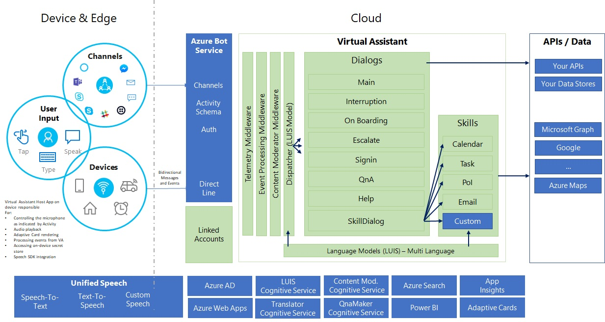

# Virtual Assistant Detailed Overview

## Virtual Assistant Architecture

An Architecture diagram of the Virtual Assistant is shown below along with a detailed explanation.

## Client Integration
End-Users can make use of the Virtual Assistant through the support Azure Bot Service Channels or through the Direct Line API that provides the ability to integrate your assistant directly into a device, mobile app or any other client experience.

Device integration requires creation of a lightweight host app which runs on the device. We have successfully built native applications across multiple embedded platforms including HTML5 applications.

The host app is responsible for the following capabilities. These can of course be extended depending on the device capabilities.
    - Open and closing the microphone has indicated through the InputHint on messages returned by the Assistant
    - Audio playback of responses created by the Text-to-Speech service
    - Rendering of Adaptive Cards on the device through a broad range of renderers supplied with the Adaptive Cards SDK
    - Processing events received from the Assistant, often to perform on device operations (e.g. change navigation destination)
    - Accessing the on-device secret store to store and retrieve a token for communication with the assistant
    - Integration with the Unified Speech SDK where on-device speech capabilities are required
    - Interface to the Direct-Link REST API or SDKs
    - Authenticating the end user of the device and providing a unique userId to the Assistant. Microsoft has capabilities to help with this if needed.

## Assistant Middleware

The Assistant makes use of a number of Middleware Components to process incoming messages:
    - Telemetry Middleware leverages Application Insights to store telemetry for incoming messages, LUIS evaluation and QNA activities. PowerBI can then use this data to surface conversational insights.
    - Event Processing Middleware processes events sent by the device
    - Content Moderator Middleware uses the Content Moderator Cognitive Service to detect inappropriate / PII content]]

## Advanced Conversational Analytics
The Assistant is configured to collect telemetry into Application Insights. This can be imported into a PowerBI dashboard to view [advanced conversational analytics](https://aka.ms/botPowerBiTemplate).

## Dispatcher

The Dispatcher is trained across a variety of Natural Language data sources to provide a unified NLU powered dispatch capability. LUIS models from the Assistant, each configured Skill and questions from QnAMaker are all ingested as part of the dispatcher training process. This training process can also provide evaluation reports to identify confusion and overlap.

This training process creates a Dispatcher LUIS model which is then used by the Assistant to identify the component that should handle a given utterance. When a dialog is active the Dispatcher model is only used to identify top level intents such as Cancel for interruption scenarios.

## Dialogs

Dialogs represent conversational topics that the Assistant can handle. The `SkillDialog` is provided with the Virtual Assistant to handle the invocation of Skills based on the Dispatcher identifying an utterance should be passed to a skill. Subsequent messages are routed to the Active dialog for processing until the dialog has ended.

Skills at this time are invoked *in-process* through activating the Skill in an accompanying assembly file. An in-process Bot Framework adapter ensures the bot communication protocol is utilised for skill messaging.  

## Integration

The Assistant and Skills can then make use of any APIs or Data Sources in the same way any web-page or service. This enables your Assistant to make use of existing capabilities and data sources as part of conversation flow.

## Authentication

The Assistant and associated Skills often need access to end-user authentication tokens in order to perform operations on behalf of the user. OAuth authentication providers are supported by the Azure Bot Service and provide the ability for you to configure providers such as Active Directory (for Office 365), Facebook or your own.

Authentication connections are created on the Azure Bot Service and the Assistant makes use of these to initiate an authentication request (generating an OAuth signin card) or retrieve a token from the Azure Bot Service provided secure token store.

Skills can request Authentication tokens for a given user when they are activated, this request is passed as an event to the Assistant which then uses the specific Authentication connection to surface an authentication request to the user if a token isn't found in the secure store.

## Linked Accounts
Linked Accounts is a supporting web application that demonstrates how a user can link their Assistant to their digital properties (e.g. Office 365, Google, etc.) on a companion device (mobile phone or website). This would be done as part of the on-boarding process and avoids authentication prompts during voice scenarios.

This integrates with the Authentication capability detailed above and provides a mechanism for a user to unlink all accounts which can be used as part of a device *forget me* feature.

## Edge Enablement
Many assistant scenarios require cloud-connectivity to access down-stream APIs or data sources (e.g. Office 365, Navigation data, Music Services, etc.). There are however a class of assistant scenarios especially those running on devices that may have periods of poor connectivity where pushing Speech, Language Processing and Dialog management onto the Edge (device) is needed.

We have a number of options to address this depending on platform and are working with initial customers to deliver this capability.