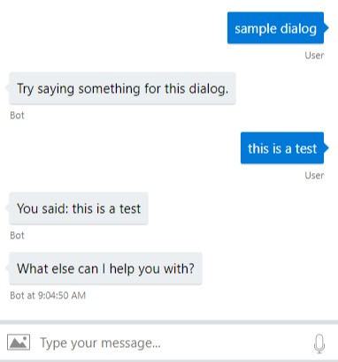

# Creating a skill using the Skill Template
1. Install VSIX from [MyGet](https://botbuilder.myget.org/gallery/aitemplates).
1. Add a new **Skill Template with Tests** project to your solution in the Skills folder
    

    

    

1. Add references to **Microsoft.Bot.Solutions** to your new skill and test projects
1. Rebuild project to verify there are no errors.
1. Update the Virtual Assistant deployment scripts.
    - Add the LUIS config for your skill to the **bot.recipe** file for all languages.
        ```
        {
            "type": "luis",
            "id": "MySkill",
            "name": "MySkill",
            "luPath": "..\\skills\\MySkill\\MySkill\\CognitiveModels\\LUIS\\en\\MySkill.lu"
        }
        ```
    - Add references to your skill intents in **dispatch.lu** for all languages
        ```
        # l_MySkill 
        - [Sample intent](../../../../skills/MySkill/MySkill/CognitiveModels/LUIS/en/MySkill.lu#Sample)
        ```
1. Run **deploy_bot.ps1**
1. In Virtual Assistant, add a reference to your new skill project.
1. In Virtual Assistant, add your skill configuration to **appsettings.json**
    ```
       "skills":[
            {
                "type": "skill",
                "id": "MySkill",
                "name": "MySkill",
                "assembly": "MySkill.MySkill, MySkill, Version=1.0.0.0, Culture=neutral",
                "dispatchIntent": "l_MySkill",
                "supportedProviders": [],
                "luisServiceIds": [
                    "MySkill",
                    "general"
                ],
                "parameters": [],
                "configuration": {}
            }
        ]
    ```
1. Run the LuisGen tool to update Dispatch.cs.
    ```
    LUISGen DeploymentScripts\en\dispatch.luis -cs Dispatch -o Dialogs\Shared\Resources 
    ```
1. Update **MainDialog.cs** with the dispatch intent for your skill.
    

1. Run the Virtual Assistant project.
1. Test your new skill with the query "sample dialog".

    

# Customizing your Skill
1. Start by identifying the different tasks your skill will handle
1. Create a LUIS model
    - Keep your intents discrete and avoid overlap with other skills you'll be adding to your assistant.
1. Create your dialog flows
    - Consider both the local and skill mode experience in your design. A skill should work well in isolation and when included in an assistant solution. 
    - When your skill is ready to hand control back to the assistant solution, it must send an EndOfConversation activity. This is handled in the template in MainDialog.CompleteAsync(). 
1. Update the skill configuration in Virtual Assistant appsettings.json
    - **supportedProviders**: this section is for identifying the different authentication providers your skill supports. If your skill does not provide an authenticated experience, leave this section blank.

        ```
            "supportedProviders": [
                "Azure Active Directory v2",
                "Google"
            ]
        ```
        The value is the "Service Provider" from your OAuth connection in the Azure portal.

        

    - **luisServiceIds**: this section identifies which LUIS service configurations should be sent from the Virtual Assistant to your skill. Include ids for any LUIS models your skill will need to access in this list. The id for a LUIS service is found in the .bot file configuration.
        ```
            "luisServiceIds": [
                "calendar",
                "general"
            ]
        ```
    - **parameters**: this section is for state values the Virtual Assistant should pass to your skill. For example, the Assistant might have access to the user's location, timezone, and other preferences that tha skill might want to access.
        ```
            "parameters": [
                "IPA.Timezone"
            ]
        ```
    - **configuration**: this section is for any additional key/value configuration the skill may need. For example, if there is a service subscription key the skill needs, this should be supplied through the Virtual Assistant and will be passed to the skill at initialization.
        ```
            "configuration": {
                "AzureMapsKey": ""
            }
        ```
