# Conversational Analytics Telemetry
[Application Insights](https://azure.microsoft.com/en-us/services/application-insights/) is an Azure service which enables 
analytics about your applications, infrastructure and network. The Bot Framework can use the  Application Insights telemetry to
 provide information about how your bot is performing, and track key metrics. The Bot Framework SDK ships with several samples
 that demonstrate how to add telemetry to your bot and produce reports (included).

[Power BI](https://powerbi.microsoft.com/) is a business analytics services that lets you visualize your data and share 
insights across your organization. You can ingest data from Application Insights into live dashboards and reports.

## Table of Contents
- [Prerequisites](#prerequisites)
- [Configuring LUIS Sentiment](#configuring-sentiment)
- [Power BI Installation](#power-bi-installation)
- [Application Insights Analytics](#application-insights-analytics)
- [Power BI Sample](#power-bi)

## Prerequisites
The [Conversational Analytics Power BI sample](ConversationalAnalyticsSample.pbit) is generated 
under the assumption you are using the latest Bot Framework SDK and telemetry middleware. You can find these (and generate the required Application Insights resource) with the following samples:

 - [Enterprise Template](https://github.com/Microsoft/BotBuilder-Samples/tree/master/samples/csharp_dotnetcore/20.qna-with-appinsights)
 - [LUIS with App Insights bot](https://github.com/Microsoft/BotBuilder-Samples/tree/master/samples/csharp_dotnetcore/21.luis-with-appinsights)
 - [QnA with App Insights bot](https://github.com/Microsoft/BotBuilder-Samples/tree/master/samples/csharp_dotnetcore/20.qna-with-appinsights)
 - [Virtual Assistant](https://github.com/Microsoft/BotBuilder-Samples/tree/master/samples/csharp_dotnetcore/20.qna-with-appinsights)

### Configuring Sentiment
LUIS enables you to run a sentiment analysis on a user's utterance. This can be enabled through the [LUIS portal](https://www.luis.ai).
Sentiment must be enabled for each application.  To enable sentiment:
1. Log in to the portal.
2. Select **My Apps**.
3. Click on the specific application you want to enable sentiment.
4. Select **Manage** on the upper menu.
5. Select **Publish Settings** on the side menu. It should resemble the below.
 
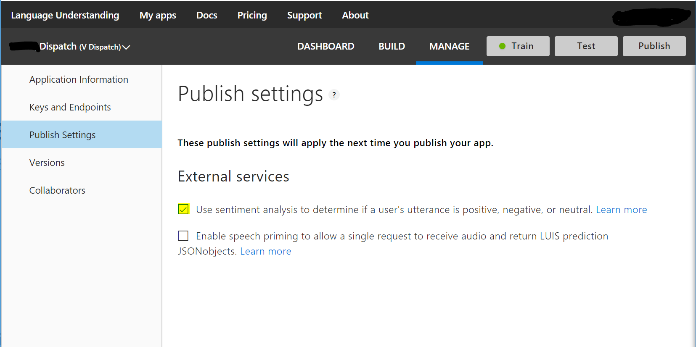

6. **Enable** the *Use sentiment analysis to determine if a user's utterance is positive, negative, or neutral* checkbox.
7. Select **Publish** and repeat for each LUIS application.

### Power BI  Installation
The [PowerBI Desktop client](https://aka.ms/pbidesktopstore) is available for Windows clients.
Alternatively, you can use the Power BI service.  If you don't have a PowerBI service account, sign up for a [free 60 day trial account](https://app.powerbi.com/signupredirect?pbi_source=web) and upload the Power BI template to view the reports.

## Application Insights
[Applications Insights Analytics](docs/analytics-applicationinsights) demonstrates how to execute common queries for for bot analytics and debugging in Visual Studio.

## Power BI
The  [Conversational Analytics Power BI sample](ConversationalAnalyticsSample.pbit) provides a PowerBI template that can be used to understand how your bot is performing.

### Sample Overview
|Dashboard Name|Description|
|-|-|
|[Overall Usage](#overall-usage)| Provides general insights like unique users, total number of messages, and number of conversations per day|
|[All Dialogs Overview](#all-dialogs-overview)| All dialogs' popularity and status based off of SDK telemetry.|
|[Dialog Overview](#dialog-overview)| A specific dialog's popularity, status,  and average bot/user turn count.|
|[All Conversations Metrics](#all-conversations-metrics)| Highlights the average number of conversations per unique user and the average duration by day.|
|[Conversations Drill Down](#conversations-drill-down)| Per conversation, this highlights the dialogs triggered and common utterances.|
|[Transcript](#transcript)| Highlights a count of interactions, session duration, and the transcript between bot and users per unique conversation.|
|[Demographics](#demographics)| Demonstrates where users are connecting to your bot and the languages they are using.|
|[Word Cloud](#word-cloud)| Shows a word cloud and tree map of common uttered phrases.|
|[Sentiment](#sentiment)| If sentiment analysis is enabled, will show the average sentiment by day.|
|[QnA Maker Insights](#qna-maker-insights)| Shows insights on user utterances matches with QnA Maker. |

#### Sample Query using Application Insights

Below is a sample query to create a `conversationalai` table in Power BI. This extracts bot activity, QnA results, sentiment and demographic data.

You will need to replace `<app-insights-application-id>` with your Application Insights Application ID, which can be obtained by:
1. Log in to the [Azure Portal](https://portal.azure.com/).
2. Navigate to your Application Insights resource.
3. Select **API Access**.
4. Copy the Application ID.

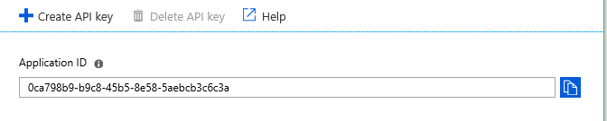

```
let AnalyticsQuery =
let Source = Json.Document(Web.Contents("https://api.loganalytics.io/v1/apps/" & <app-insights-application-id> & "/query",
[Query=[#"query"="customEvents
| project 
timestamp, 
Name = name, 
ConversationID=session_Id, 
Channel=customDimensions.channelId, 
Language = customDimensions.locale,
Text = customDimensions.text, 
Question = customDimensions.question,
FoundInKnowledgeSource = customDimensions.articleFound,
UserAcceptedAnswer = customDimensions.userAcceptedAnswer,
KnowledgeItemsDiscarded = customDimensions.knowledgeItemsDiscarded,
FromName = customDimensions.fromName,
Score = customDimensions.score, 
Sentiment = customDimensions.sentimentScore,
client_Type,
client_City, 
client_StateOrProvince, 
client_CountryOrRegion,
QnAResponse=customDimensions.answer, 
QnAFeedbackScore=customDimensions.feedbackScore, 
QnAConfidenceScore=customDimensions.confidenceScore,
QnAQuery=customDimensions.question
| where timestamp > ago(90d)
| order by timestamp desc  
",#"x-ms-app"="AAPBI"],Timeout=#duration(0,0,4,0)])),
TypeMap = #table(
{ "AnalyticsTypes", "Type" }, 
{ 
{ "Double",   Double.Type },
{ "Int64",    Int64.Type },
{ "Int32",    Int32.Type },
{ "Int16",    Int16.Type },
{ "UInt64",   Number.Type },
{ "UInt32",   Number.Type },
{ "UInt16",   Number.Type },
{ "Byte",     Byte.Type },
{ "Single",   Single.Type },
{ "Decimal",  Decimal.Type },
{ "TimeSpan", Duration.Type },
{ "datetime", DateTimeZone.Type },
{ "string",   Text.Type },
{ "boolean",  Logical.Type },
{ "SByte",    Logical.Type }
}),
DataTable = Source[tables]{0},
Columns = Table.FromRecords(DataTable[columns]),
ColumnsWithType = Table.Join(Columns, {"type"}, TypeMap , {"AnalyticsTypes"}),
Rows = Table.FromRows(DataTable[rows], Columns[name]), 
Table = Table.TransformColumnTypes(Rows, Table.ToList(ColumnsWithType, (c) => { c{0 }, c{3}}))
in
Table
in
    AnalyticsQuery
```

#### Overall Usage
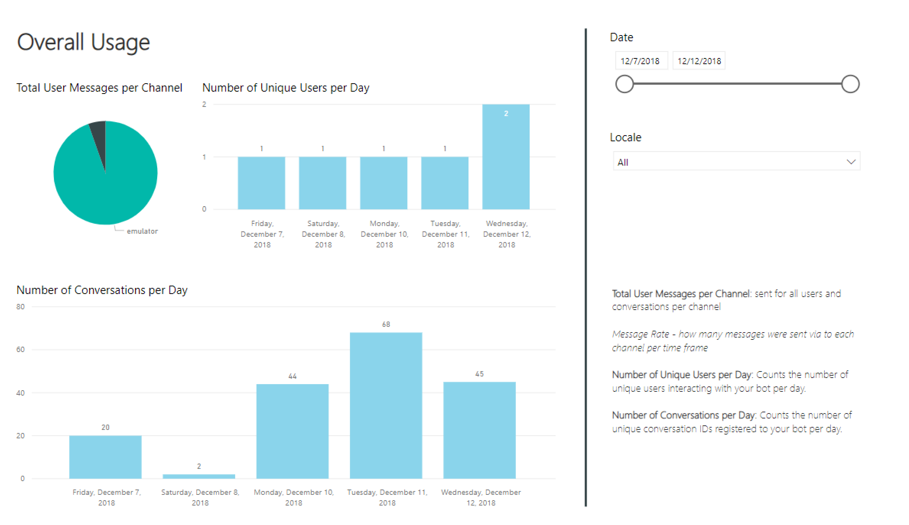
#### All Dialogs Overview
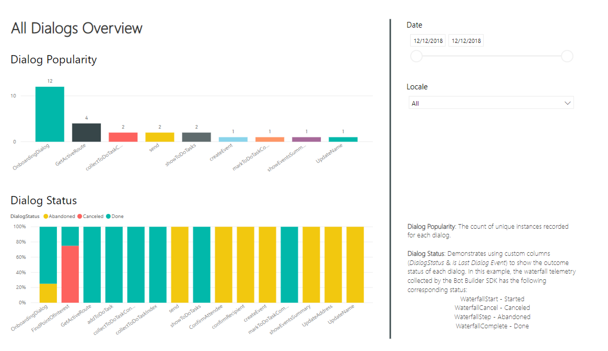
#### Dialog Overview
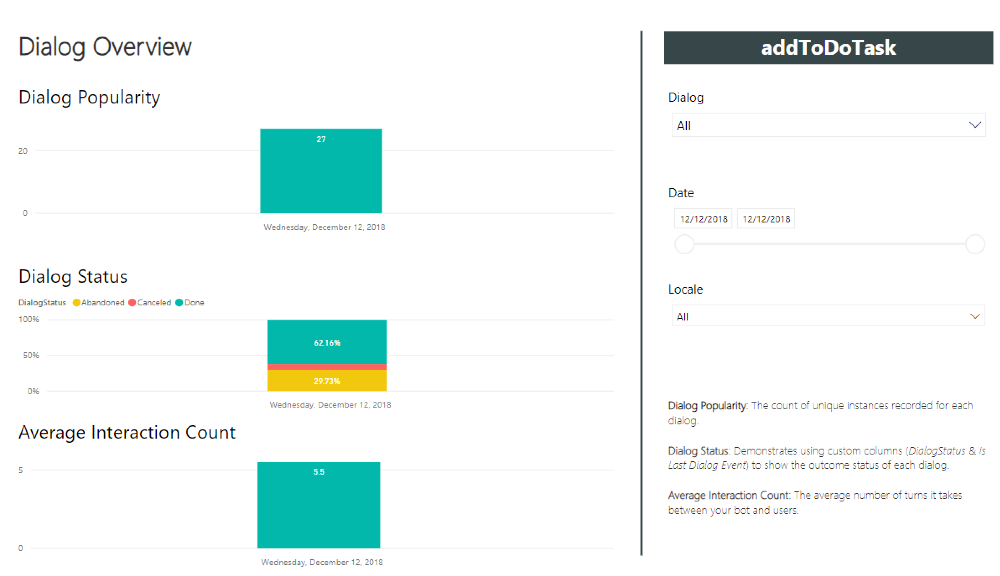
#### All Conversations Metrics
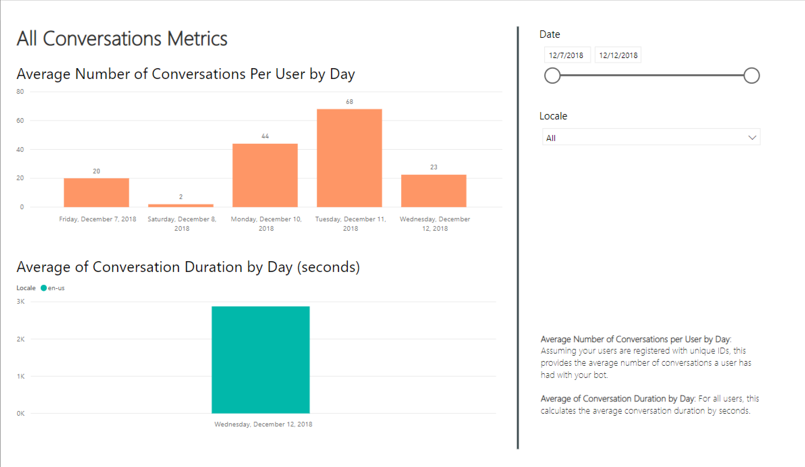
#### Conversations Drill Down
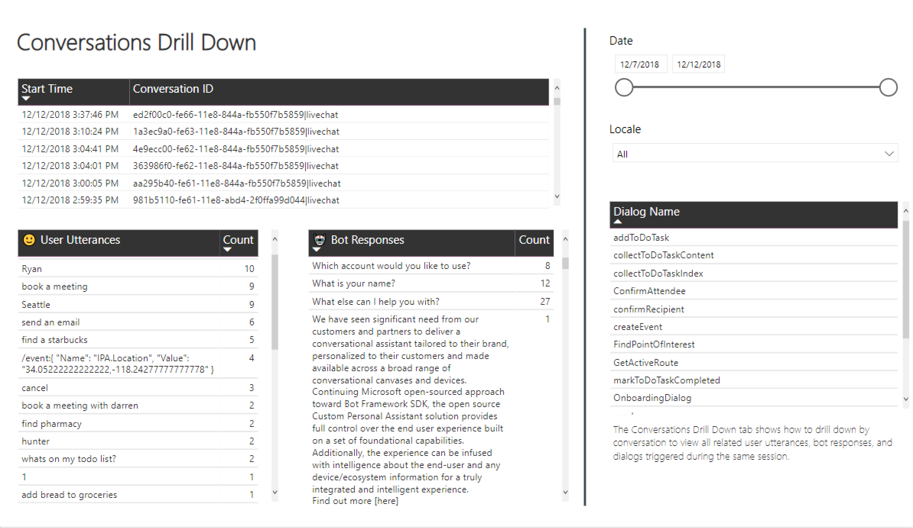
#### Transcript
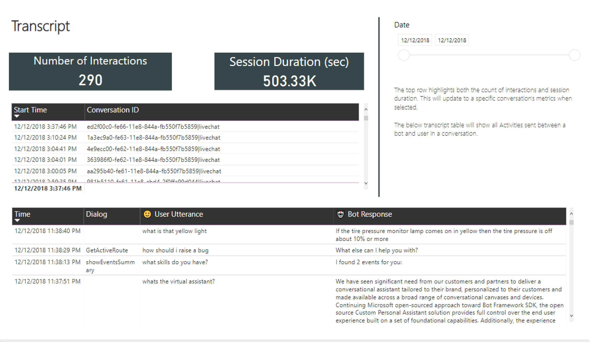
#### Demographics
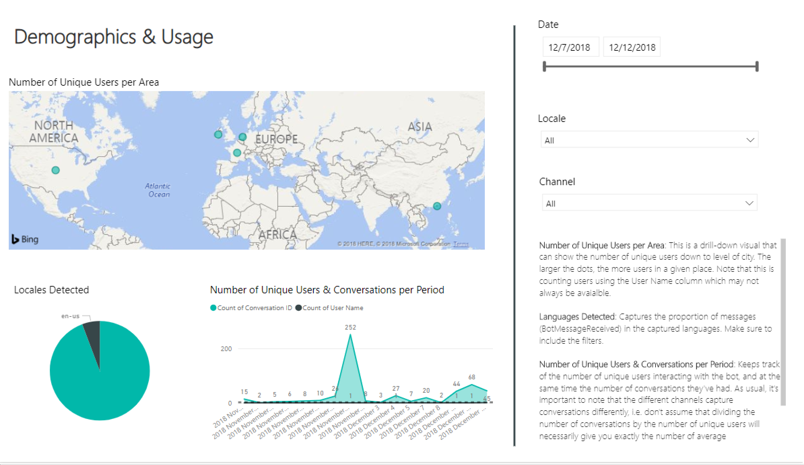
#### Word Cloud
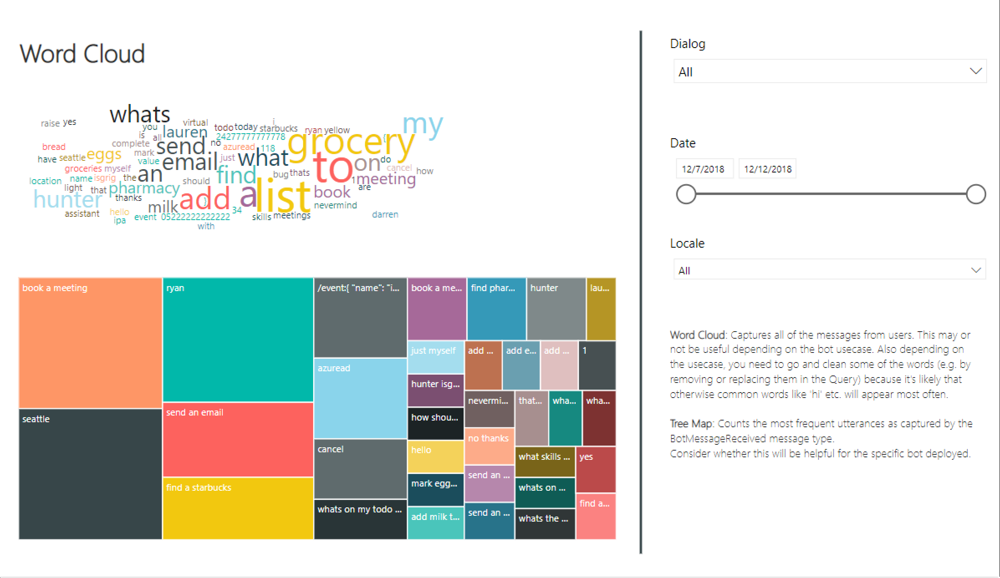
#### Sentiment
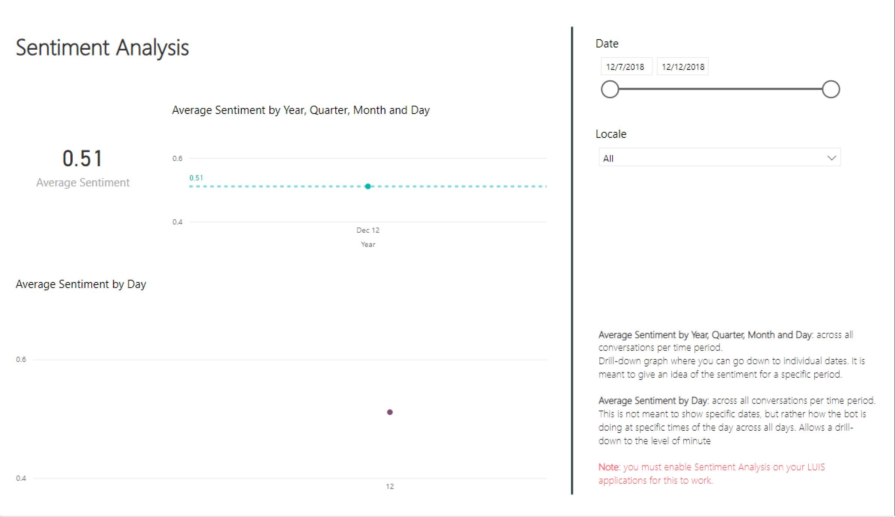
#### QnA Maker Insights
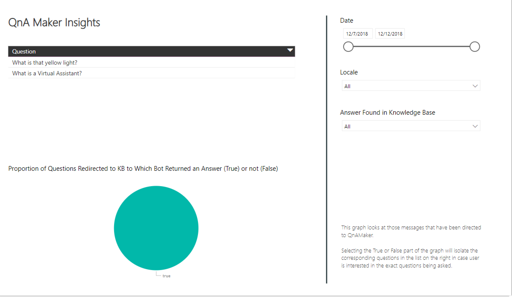
