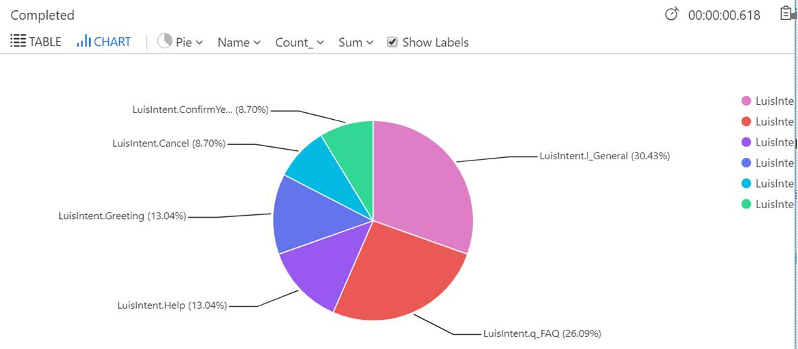
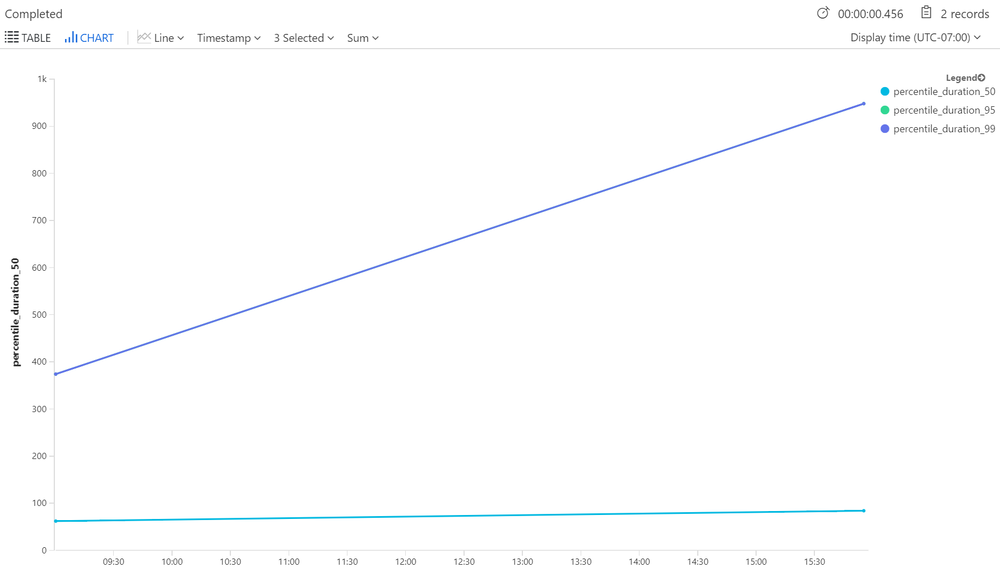

# Application Insights Analytics
The following provide some examples of retrieving data about your bot, to better understand how your bot (and related services) are performing.

###  LUIS Intents Piechart

The following demonstrates querying data that was generated by LUIS telemetry.  The telemetry logs the top intent from the recognizer (in addition to some other properties), and logs an [Application Insights Custom Event](https://docs.microsoft.com/en-us/azure/application-insights/app-insights-api-custom-events-metrics).


```
customEvents
| where timestamp >= ago(24h)
| where name startswith "LuisIntent"
| summarize count() by name
| order by count_ desc
| render piechart
```

### P50, P95, P99 for Services

The following query demonstrates querying data from the Application Insights `dependencies` table which models calls to external components.



CosmosDB
```
dependencies
| where timestamp >= now(-1d)
| where type == "Azure DocumentDB"
| summarize percentiles(duration,50,95,99) by bin (timestamp, 1m)
| render timechart
```
Azure Blob Storage
```
dependencies
| where timestamp >= now(-1d)
| where type == "Azure blob"
| summarize percentiles(duration,50,95,99) by bin (timestamp, 1m)
| render timechart
```
LUIS

```
dependencies
| where timestamp >= now(-1d)
| where type == "HTTP" and name contains "/luis"
| summarize percentiles(duration,50,95,99) by bin (timestamp, 1m)
| render timechart
```

## Using Application Insights in Visual Studio
Within Visual Studio, Application Insights events can be queried in the "Application Insights Search" window.  [For more details, see the Application Insights documentation](https://docs.microsoft.com/en-us/azure/application-insights/app-insights-diagnostic-search).


Clicking on "Track Operation" on the details of any event can give you a visualization of where time is being spent, using the events in the telemetry that are automatically correlated:


With this view, you can quickly understand where time is being spent within your bot.

## Disabling Application Insights

To turn off Application Insights logging for C#, open up the `Startup.cs` file and uncomment the following lines:

```csharp
       public void Configure(IApplicationBuilder app, IHostingEnvironment env)
        {
            // Uncomment to disable Application Insights.
            // var configuration = app.ApplicationServices.GetService<Microsoft.ApplicationInsights.Extensibility.TelemetryConfiguration>();
            // configuration.DisableTelemetry = true;
```


