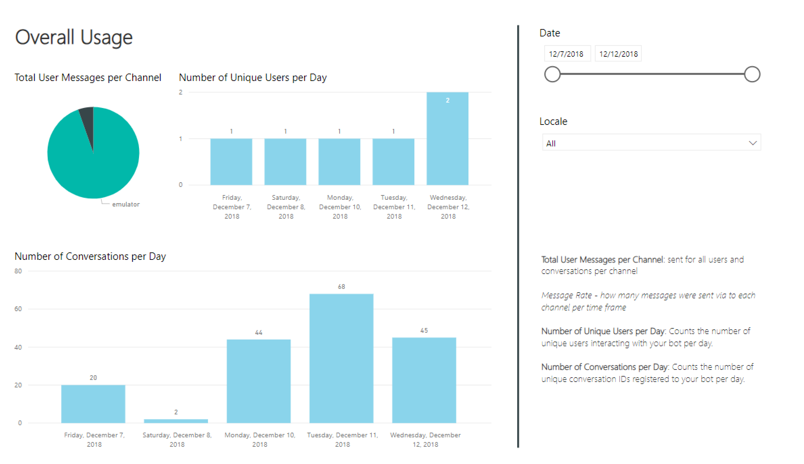
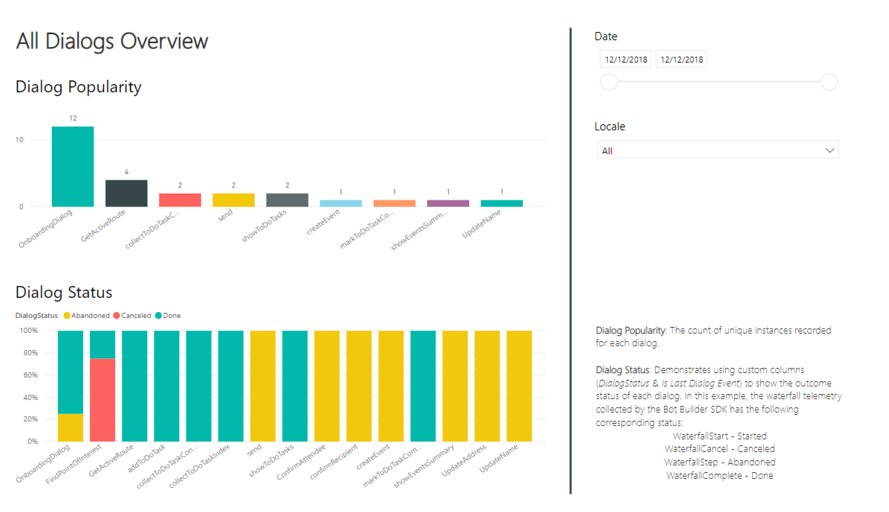
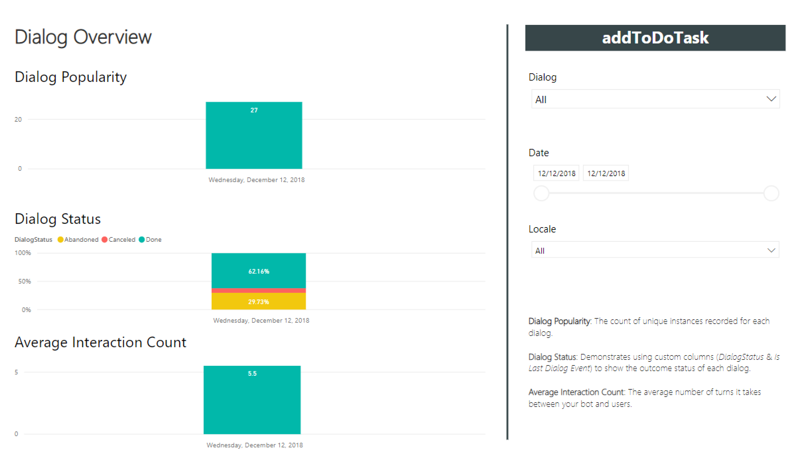
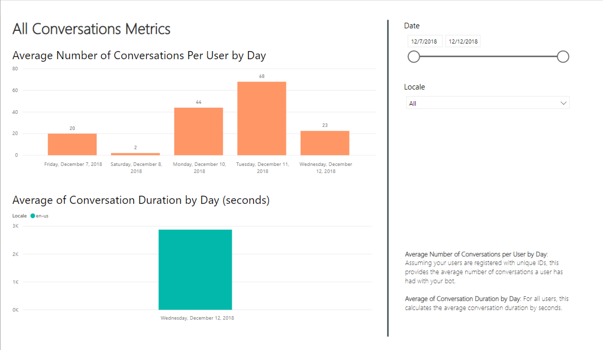
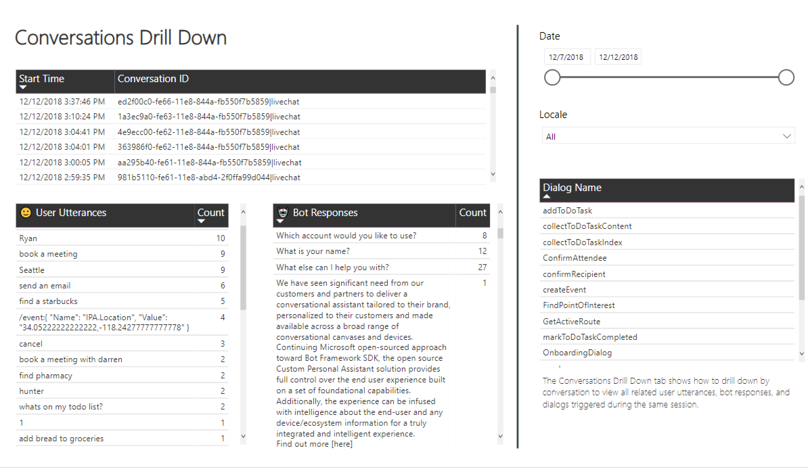
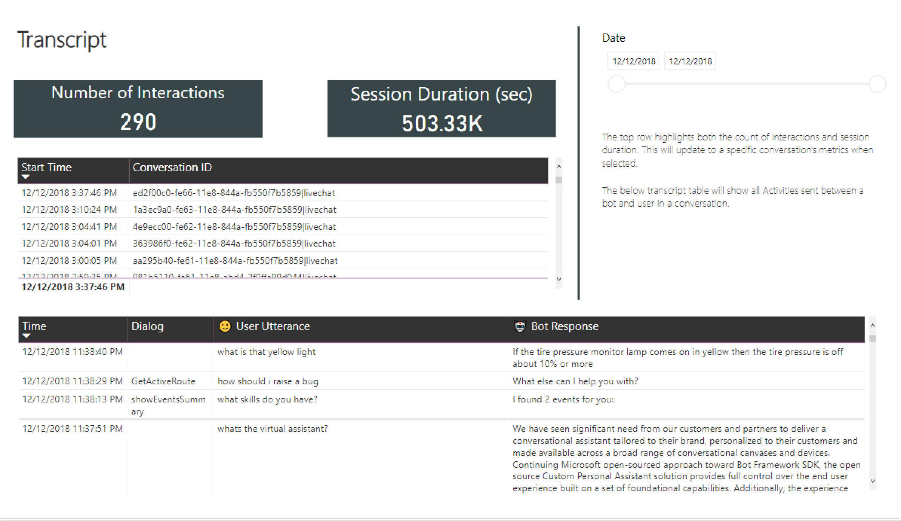
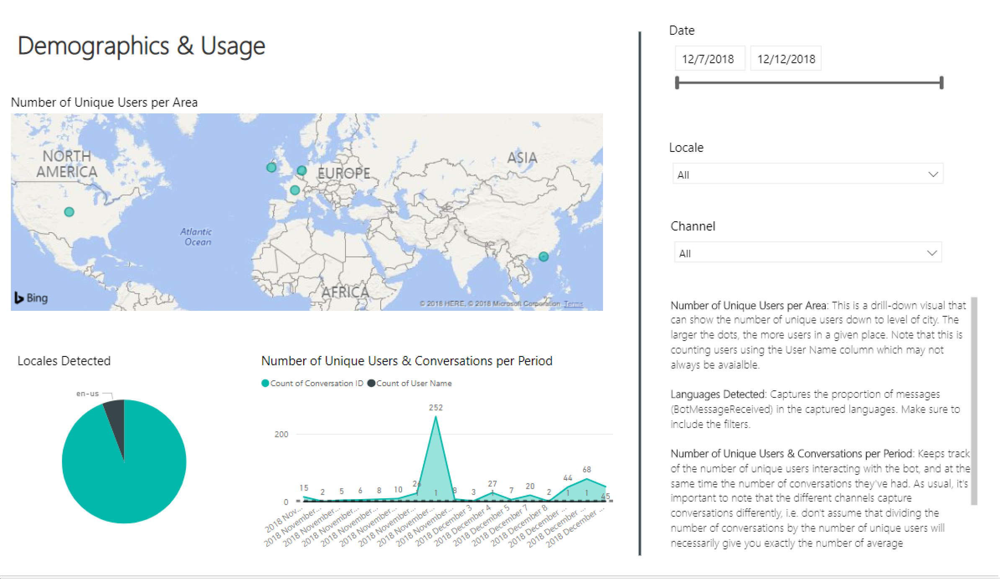
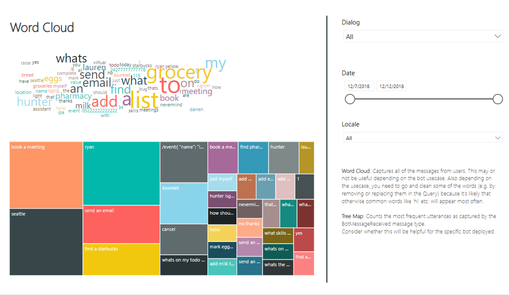
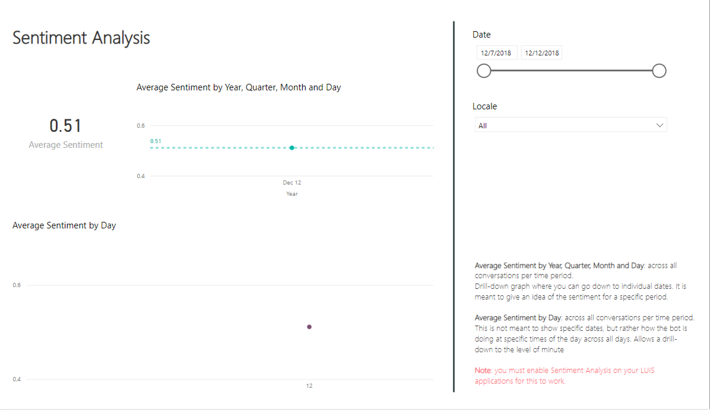
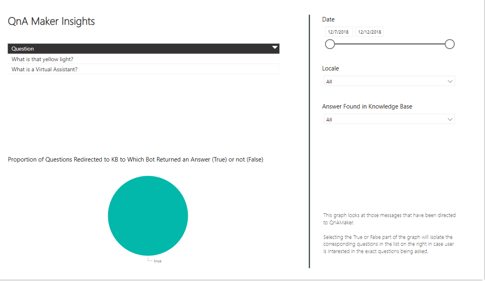

# Power BI
The  [Conversational Analytics Power BI sample](../ConversationalAnalyticsSample_02132019.pbit) provides a PowerBI template that can be used to understand how your bot is performing.

## Sample Overview
|Dashboard Name|Description|
|-|-|
|[Overall Usage](#overall-usage)| Provides general insights like unique users, total number of messages, and number of conversations per day|
|[All Dialogs Overview](#all-dialogs-overview)| All dialogs' popularity and status based off of SDK telemetry.|
|[Dialog Overview](#dialog-overview)| A specific dialog's popularity, status,  and average bot/user turn count.|
|[All Conversations Metrics](#all-conversations-metrics)| Highlights the average number of conversations per unique user and the average duration by day.|
|[Conversations Drill Down](#conversations-drill-down)| Per conversation, this highlights the dialogs triggered and common utterances.|
|[Transcript](#transcript)| Highlights a count of interactions, session duration, and the transcript between bot and users per unique conversation.|
|[Demographics](#demographics)| Demonstrates where users are connecting to your bot and the languages they are using.|
|[Word Cloud](#word-cloud)| Shows a word cloud and tree map of common uttered phrases.|
|[Sentiment](#sentiment)| If sentiment analysis is enabled, will show the average sentiment by day.|
|[QnA Maker Insights](#qna-maker-insights)| Shows insights on user utterances matches with QnA Maker. |

### Sample Query using Application Insights

Below is a sample query to create a `conversationalai` table in Power BI. This extracts bot activity, QnA results, sentiment and demographic data.

You will need to replace `<app-insights-application-id>` with your Application Insights Application ID, which can be obtained by:
1. Log in to the [Azure Portal](https://portal.azure.com/).
2. Navigate to your Application Insights resource.
3. Select **API Access**.
4. Copy the Application ID.


```
let AnalyticsQuery =
let Source = Json.Document(Web.Contents("https://api.loganalytics.io/v1/apps/" & <app-insights-application-id> & "/query",
[Query=[#"query"="customEvents
| project 
timestamp, 
Name = name, 
ConversationID=session_Id, 
Channel=customDimensions.channelId, 
Language = customDimensions.locale,
Text = customDimensions.text, 
Question = customDimensions.question,
FoundInKnowledgeSource = customDimensions.articleFound,
UserAcceptedAnswer = customDimensions.userAcceptedAnswer,
KnowledgeItemsDiscarded = customDimensions.knowledgeItemsDiscarded,
FromName = customDimensions.fromName,
Score = customDimensions.score, 
Sentiment = customDimensions.sentimentScore,
client_Type,
client_City, 
client_StateOrProvince, 
client_CountryOrRegion,
QnAResponse=customDimensions.answer, 
QnAFeedbackScore=customDimensions.feedbackScore, 
QnAConfidenceScore=customDimensions.confidenceScore,
QnAQuery=customDimensions.question
| where timestamp > ago(90d)
| order by timestamp desc  
",#"x-ms-app"="AAPBI"],Timeout=#duration(0,0,4,0)])),
TypeMap = #table(
{ "AnalyticsTypes", "Type" }, 
{ 
{ "Double",   Double.Type },
{ "Int64",    Int64.Type },
{ "Int32",    Int32.Type },
{ "Int16",    Int16.Type },
{ "UInt64",   Number.Type },
{ "UInt32",   Number.Type },
{ "UInt16",   Number.Type },
{ "Byte",     Byte.Type },
{ "Single",   Single.Type },
{ "Decimal",  Decimal.Type },
{ "TimeSpan", Duration.Type },
{ "datetime", DateTimeZone.Type },
{ "string",   Text.Type },
{ "boolean",  Logical.Type },
{ "SByte",    Logical.Type }
}),
DataTable = Source[tables]{0},
Columns = Table.FromRecords(DataTable[columns]),
ColumnsWithType = Table.Join(Columns, {"type"}, TypeMap , {"AnalyticsTypes"}),
Rows = Table.FromRows(DataTable[rows], Columns[name]), 
Table = Table.TransformColumnTypes(Rows, Table.ToList(ColumnsWithType, (c) => { c{0 }, c{3}}))
in
Table
in
    AnalyticsQuery
```

### Overall Usage

### All Dialogs Overview

### Dialog Overview

### All Conversations Metrics

### Conversations Drill Down

### Transcript

### Demographics

### Word Cloud

### Sentiment

### QnA Maker Insights

