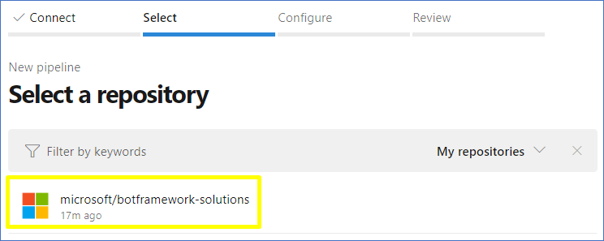
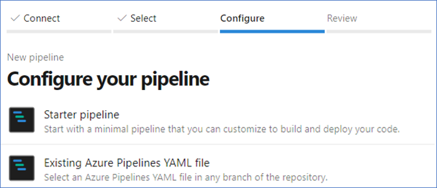

# Overview

Learn how to create a build in *Pipelines* using a `YAML` file as configuration, as it's an easy way to configure one or many specific branches with an existing `YAML` or creating a new one. You can add different scripts using the tools of *Pipelines* or writing directly the different Tasks that the *Pipeline* needs to execute.

## In this tutorial

- [Intro](#intro)
- [Create a YAML file](#create-a-YAML-file)
- [Configure build step by step in Pipelines](#Configure-build-step-by-step-in-Pipelines)

## Intro

### Prerequisites

Set up an *Azure DevOps* account. 

### Time to Complete

15 minutes

### Scenario

A personalized build in *Pipeline* usign a `YAML` file.

## Create a YAML file 

In first place, you need to create a `YAML` file with the configuration that the *Pipeline* will use to build the branch. This is according to the needs of the user.

This is an example to configure the `YAML` file. You are able to create or add this file in the root of our project or in any location, this doesn't affect or change the functionality of the `YAML`.
```
# specific branch build
trigger:
  branches:  
    include:
    - master
    - feature/*

  paths:
    include:
    - 'templates/Virtual-Assistant-Template/typescript/samples/sample-assistant/*'

pool:
  name: Hosted VS2017
steps:
- task: NodeTool@0
  displayName: 'Use Node 10.x'
  inputs:
    versionSpec: 10.x

- task: Npm@1
  displayName: 'npm install'
  inputs:
    workingDir: 'templates/Virtual-Assistant-Template/typescript/samples/sample-assistant'
    verbose: false

- task: Npm@1
  displayName: 'npm run build'
  inputs:
    command: custom
    workingDir: 'templates/Virtual-Assistant-Template/typescript/samples/sample-assistant'
    verbose: false
    customCommand: 'run build'

- task: Npm@1
  displayName: 'npm test - coverage'
  inputs:
    command: custom
    workingDir: 'templates/Virtual-Assistant-Template/typescript/samples/sample-assistant'
    verbose: false
    customCommand: 'run coverage'

- task: PublishTestResults@2
  displayName: 'publish test results'
  inputs:
    testResultsFiles: 'test-results.xml'
    searchFolder: 'templates/Virtual-Assistant-Template/typescript/samples/sample-assistant'
    failTaskOnFailedTests: true

- task: PublishCodeCoverageResults@1
  displayName: 'publish code coverage'
  inputs:
    codeCoverageTool: Cobertura
    summaryFileLocation: 'templates/Virtual-Assistant-Template/typescript/samples/sample-assistant/coverage/cobertura-coverage.xml'
    reportDirectory: 'templates/Virtual-Assistant-Template/typescript/samples/sample-assistant/coverage/'
```
## Configure build step by step in Pipelines

1. With the `YAML` file configurated you can go to *Azure DevOps* site and proceed to add the new build Pipeline. Selecting the *Pipelines* option, will appear the build *Pipelines* like the following screenshot: 

<p align="center">

</p>

2. Then, selecting the option 'New', will add a new pipeline. The next step will be to connect with the code and for that the recommended option is `GitHub with YAML`.

<p align="center">

</p>

3. Select the repository that will include the build *Pipelines*

<p align="center">

</p>

4. You will use an existing `YAML` file for this purpose.

<p align="center">

</p>

5. You can use the `YAML` file created before by completing the path with the location of the `YAML` file. It's also necessary to select the branch that has the file. 

<p align="center">

</p>

6. The build was created successfully and you can see the configuration of the `YAML` file. The next step will be run the `YAML` to start the build process.

<p align="center">

</p>