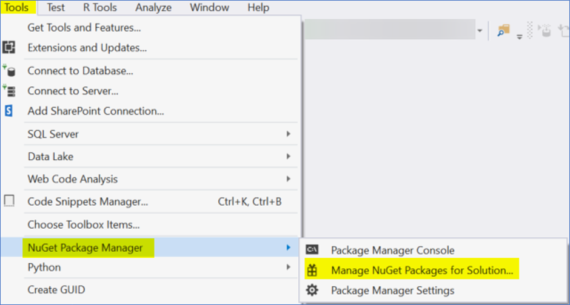
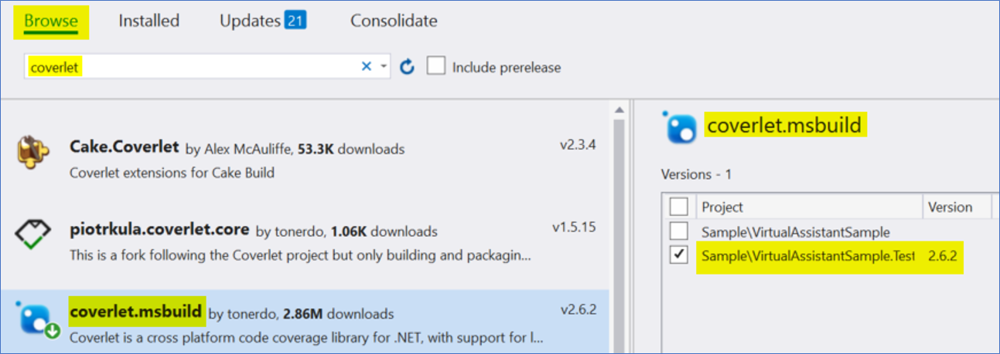
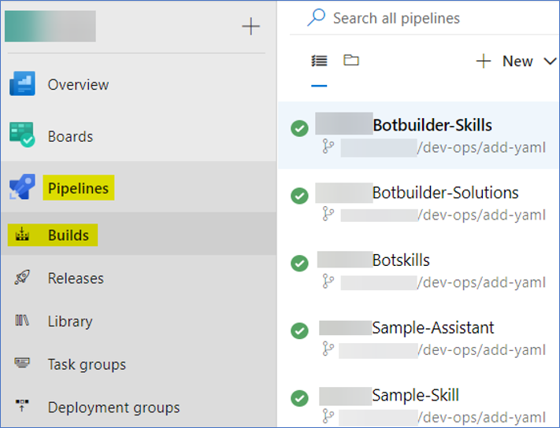
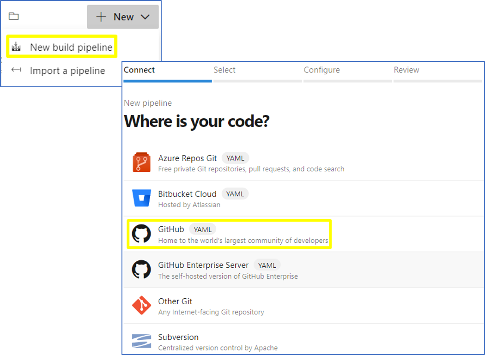
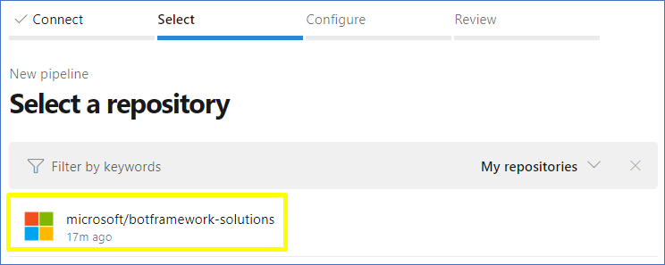
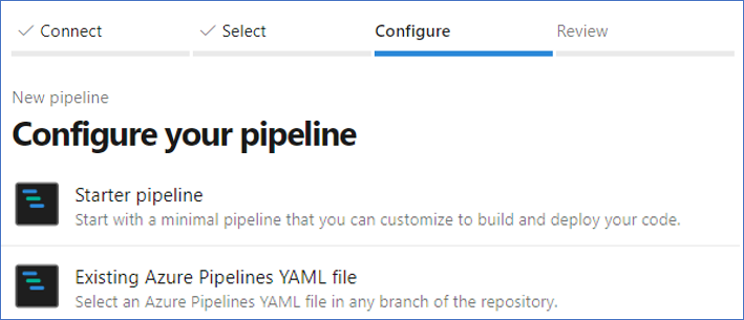
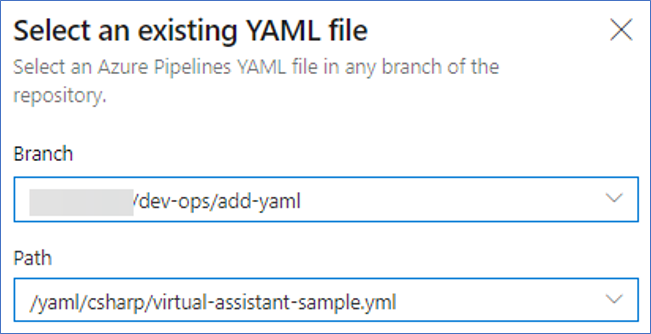
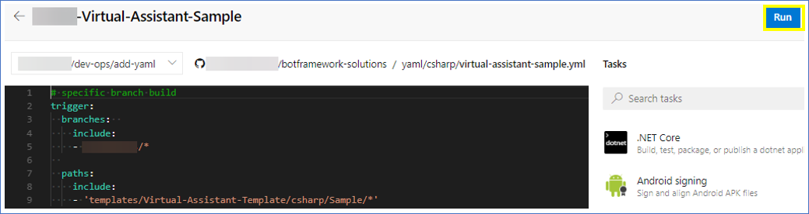

# Overview

Learn how to create a *Pipeline* using a `YAML` file as configuration, as it's an easy way to configure one or many specific branches with an existing `YAML` or creating a new one. You can add different scripts using the tools of *Pipelines* or writing directly the different Tasks that the *Pipeline* needs to execute.

## In this tutorial

- [Intro](#intro)
- [Add Coverlet to the project](#Add-Coverlet-to-the-project)
- [Create a YAML file](#Create-a-YAML-file)
- [Configure build step by step in Pipelines](#Configure-build-step-by-step-in-Pipelines)

## Intro

### Prerequisites

Set up an *Azure DevOps* account. 

### Time to Complete

15 minutes

### Scenario

A personalized *Pipeline* in *Azure DevOps* usign a `YAML` file.

## Add Coverlet to the project 
In first place, you need to add to the project the `Coverlet` package called `coverlet.msbuild`. With this will be able to show or publish the `Code Coverage` report in *Pipelines*. The easy way to add Coverlet in the project is using the `Manage Nuget Packages for Solution`.

1. First, in `VS` open the solution that will have the `Coverlet` package.

2. Go to `tools`, select the `Nuget Package Manager` and then the sub-item called `Manage Nuget Packages for Solution`. 

<p align="center">

</p>

3. Select the `Browse` option and complete the input search with `Coverlet` to see in the list the different `NuGet` that you can add to the project. In this case, select the `coverlet.msbuild` option and install it into your project.

<p align="center">

</p>

4. Finally build the solution and `Coverlet` will be added as dependency in the project. 

## Create a YAML file

Create a `YAML` file with the configuration that the *Pipeline* will use. This is according to the needs of the user.

This is an example to configure the `YAML` file. You are able to create or add this file in the root of your project or in any location, this doesn't affect or change the functionality of the `YAML`.
```
# specific branch build
trigger:
  branches:  
    include:
    - master
    - feature/*

  paths:
    include:
    - 'templates/Virtual-Assistant-Template/csharp/Sample/*'

# By default will disable PR builds
pr: none

pool:
   name: Hosted VS2017
   demands:
    - msbuild
    - visualstudio

variables:
  buildPlatform: 'Any CPU'
  buildConfiguration: 'Release'

steps:
- task: DotNetCoreInstaller@0
  displayName: 'Use .NET Core sdk 2.2.100'
  inputs:
    version: 2.2.100
  continueOnError: true

- task: NuGetToolInstaller@0
  displayName: 'Use NuGet 4.9.1'
  inputs:
    versionSpec: 4.9.1

- task: NuGetCommand@2
  displayName: 'NuGet restore'
  inputs:
    restoreSolution: 'templates\Virtual-Assistant-Template\csharp\VirtualAssistantTemplate.sln'

- task: VSBuild@1
  displayName: 'Build solution VirtualAssistantTemplate.sln'
  inputs:
    solution: templates\Virtual-Assistant-Template\csharp\VirtualAssistantTemplate.sln
    vsVersion: '16.0'
    platform: '$(buildPlatform)'
    configuration: '$(buildConfiguration)'

- task: DotNetCoreCLI@2
  displayName: 'test results'
  inputs:
    command: test
    projects: '$(System.DefaultWorkingDirectory)\templates\Virtual-Assistant-Template\csharp\Sample\VirtualAssistantSample.Tests\VirtualAssistantSample.Tests.csproj'
    arguments: '-v n --configuration $(buildConfiguration) --no-build --no-restore --filter TestCategory!=IgnoreInAutomatedBuild /p:CollectCoverage=true /p:CoverletOutputFormat=cobertura'
    workingDirectory: 'templates\Virtual-Assistant-Template\csharp\Sample\VirtualAssistantSample.Tests'

- task: PublishCodeCoverageResults@1
  displayName: 'Publish code coverage'
  inputs:
    codeCoverageTool: Cobertura
    summaryFileLocation: '$(Build.SourcesDirectory)\templates\Virtual-Assistant-Template\csharp\Sample\VirtualAssistantSample.Tests\coverage.cobertura.xml'
    reportDirectory: '$(Build.SourcesDirectory)\templates\Virtual-Assistant-Template\csharp\Sample\VirtualAssistantSample.Tests'
```
By default, the *Pipeline* automatically triggers a build for each new pull-request. This *Pipeline's* behavior can be disabled using the following configuration:
```
pr: none
```
In case that you want to activate this, you can use the following configuration:
```
pr: 
- master
```

## Configure build step by step in Pipelines

1. With the `YAML` file configurated you can go to *Azure DevOps* site and proceed to add the new Pipeline. Selecting the *Pipelines* option, will appear the builds like the following screenshot: 

<p align="center">

</p>

2. Then, selecting the option 'New', will add a new *Pipeline*. The next step will be to connect with the code and for that the recommended option is `GitHub with YAML`.

<p align="center">

</p>

3. Select the repository that will include the builds

<p align="center">

</p>

4. You will use an existing `YAML` file for this purpose.

<p align="center">

</p>

5. You can use the `YAML` file created before by completing the path with the location of the `YAML` file. It's also necessary to select the branch that has the file. 

<p align="center">

</p>

6. The *Pipeline* was created successfully and you can see the configuration of the `YAML` file. The next step will be to run the `YAML` to start the build process.

<p align="center">

</p>